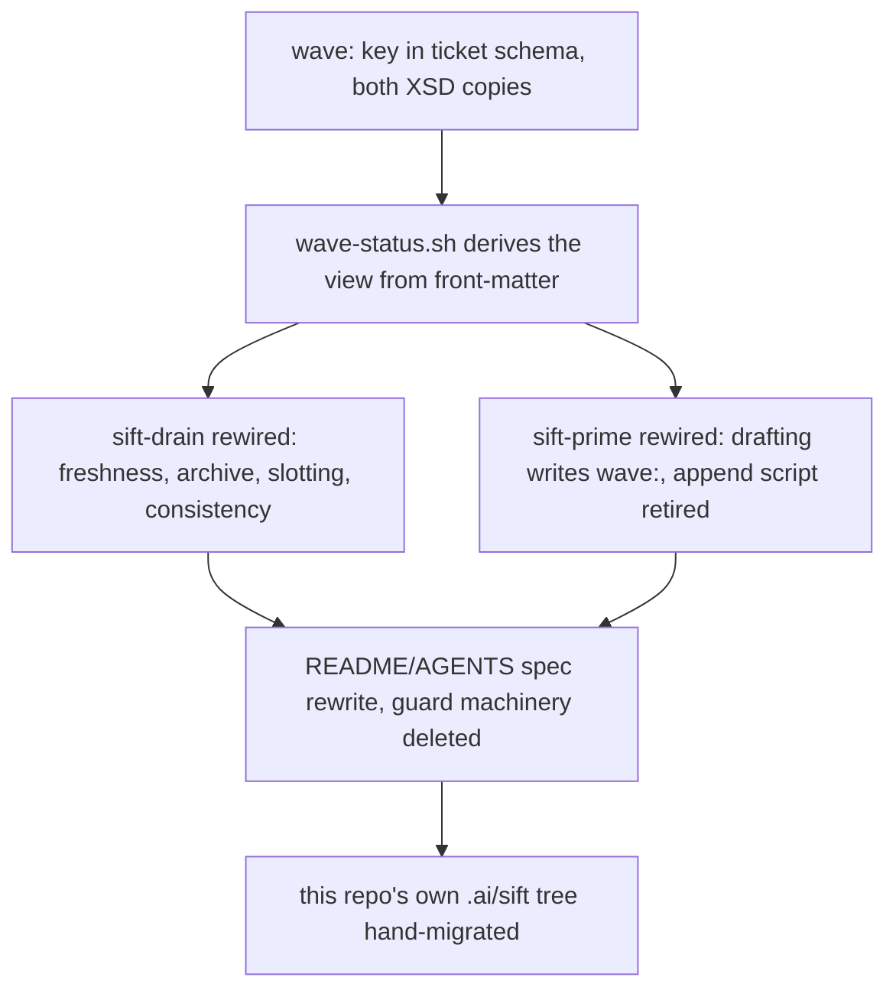
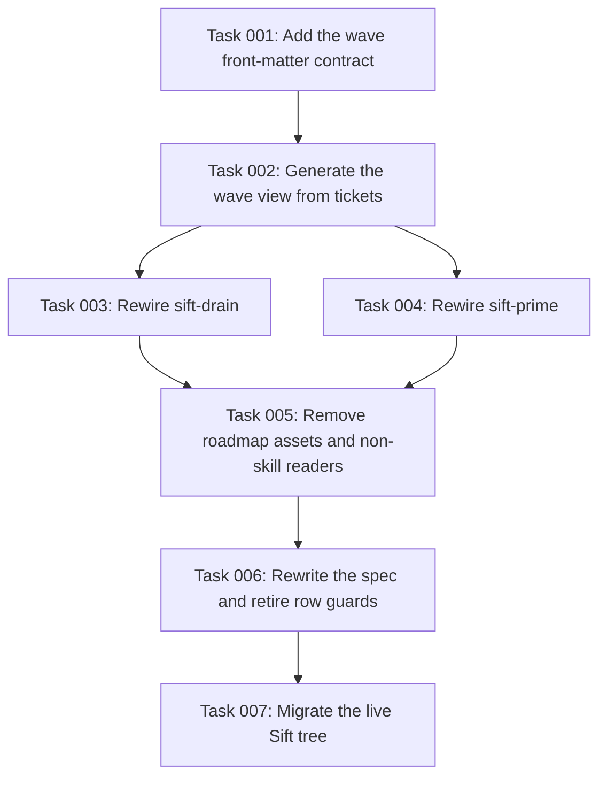

# Plan: Retire ROADMAP.md for wave front-matter

## Original Work Order

> $st-create-plan to address this, including all steps.

The "this" refers to the conversation's converged finding: `.ai/sift/ROADMAP.md`
grows monotonically by design (rule 9 strikes rows, never deletes them), the
sift-drain orchestrator is instructed to re-read the whole file before every
dispatch (`src/skills/sift-drain/SKILL.md:90`), and the file duplicates data
owned by ticket front-matter in every column except the wave number. The
original four-step order was: (1) route per-dispatch freshness through
`wave-status.sh`, (2) route strike/slot writes through named scripts,
(3) sweep struck rows at wave close, (4) replace the file with a `wave:`
front-matter key and a generated view. Clarifications below collapsed this
into the direct end state.

## Plan Clarifications

| Question | Answer |
| --- | --- |
| One plan for all steps, or the package now and the surgery as a parked second plan gated on measurement? | One plan, all steps. The measurement gate is dropped; the surgery is committed now. |
| With the surgery committed, steps 2 and 3 build machinery the surgery deletes. Build them anyway, or plan the end state directly? | Direct to end state. The sweep and the interim write helpers are not built. |
| What backwards compatibility must the surgery provide to consuming repos with live ROADMAP.md trees? | None. No runtime detection, no refusal path, no dual-mode reads. Skills assume the new shape. |
| Does the AGENTS.md-mandated one-time migration recipe still ship as documentation? | No. The user waives the AGENTS.md migration-recipe requirement for this change. Consuming trees are migrated by hand with no documented procedure. |

## Executive Summary

This plan deletes `.ai/sift/ROADMAP.md` from the Sift convention and moves its
one non-derivable datum, wave membership, into a `wave:` front-matter key on
open tickets. Everything anyone currently gets from the file becomes a
generated view: `wave-status.sh` is rewritten to derive per-wave progress from
ticket front-matter and remains the only way agents or humans read "the
roadmap". The drain and prime skills are rewired so no operation reads or
writes a shared tracker table: archiving is a front-matter edit plus `mv`,
and slotting new work is writing the `wave:` key into the ticket file itself.

The approach was chosen over managing the file (sweeping struck rows, routing
reads through scripts) because the file's costs are structural, not
incidental. Its per-dispatch full re-read makes orchestrator context cost
scale with lifetime history. Its column duplication requires rule 9, a strike
recipe, a consistency checker, a 310-line append script, and a cross-skill
row rule with an inventory and agreement tests. It is the design's single
shared-write hotspot in a convention that prefers one file per entity, and
the only file that ever needed a cksum ritual against checkout clobbering.
Removing the file removes the categories, not the instances.

Expected outcomes: drain context cost per dispatch bounded by open work
instead of lifetime history; roughly a third of the convention's guard
machinery deleted; no shared file for concurrent agents to contend on or for
a checkout to clobber; a strictly smaller spec.

## Context

### Current State vs Target State

| Current State | Target State | Why? |
| --- | --- | --- |
| Wave ordering lives in a hand-maintained ROADMAP.md table | Each open ticket carries a `wave: N` front-matter key | The table duplicates ticket data in every other column, and duplicated state drifts |
| Orchestrator re-reads the whole file before every dispatch (SKILL.md:90); cost is O(dispatches x lifetime history) | Orchestrator runs `wave-status.sh`; cost is O(remaining wave) | Observed token burn in a consuming project; struck rows never leave the file, so the cost only grows |
| Archiving a ticket is a front-matter edit, a `mv`, a row strike, and rule-9 sync in one commit | Archiving is the front-matter edit and the `mv` | The strike ceremony exists only to keep the duplicate store in sync |
| Mid-run tickets need a row slotted into the shared file; no drain-owned script exists, so the practical path is Read+Edit of the whole file | The drafting or filing agent writes `wave:` into the ticket file it already owns | One file per entity is the repo's own concurrency rule; the roadmap violates it |
| The row rule is copied across two skills, inventoried in AGENTS.md, and guarded by agreement tests | The row rule and its guard machinery cease to exist; the ID rule remains | Guard machinery is a permanent tax paid on every cross-skill change |
| ROADMAP.md is unprotected against checkout/merge clobbering; AGENTS.md mandates a cksum ritual around every ref move | No shared tracker file exists to clobber | The hazard class disappears with the file |
| `roadmap-check.sh` cross-checks the file against the tree in both directions | A consistency check validates front-matter alone: every open ticket has a wave, every `depends_on` target exists | The check becomes derivable from the entities themselves |

### Background

Evidence gathered before planning, all verified against the live tree:

- `src/skills/sift-drain/SKILL.md:90` and
  `src/skills/sift-drain/references/run-management.md:62` mandate a fresh
  ROADMAP.md read before every dispatch. Each read appends a near-identical
  copy of the full table to the orchestrator's context window.
- `wave-status.sh` already exists and its header states it exists "so a run
  can be resumed without re-reading the roadmap by eye". The skill never
  routes the per-dispatch check through it.
- The dispatch loop (SKILL.md:202-208) obliges the orchestrator to strike and
  slot rows but names no script or recipe at the point of use, so the
  path of least resistance is Read+Edit of the whole file.
- This repository's own roadmap is 136 lines of which about 110 are struck.
  Growth is monotonic under rule 9 (README.md:299-305), which requires every
  archived ticket to keep its struck row forever.
- The roadmap is explicitly advisory: "tickets' depends_on is the truth"
  (README.md:30). Priority and effort already live in ticket front-matter.
- The SFT-0082 through SFT-0086 ticket arc, the cksum ritual, and the
  restore-from-git-snapshot procedure in AGENTS.md all exist solely to defend
  this one file.

Decisions that bound this plan: no backwards compatibility of any kind, and
no migration recipe. The user explicitly waived the AGENTS.md requirement
that a layout change ship with a runnable migration recipe. That waiver
applies to this change only; the AGENTS.md rule itself stays in force for
future changes. Consequence accepted: consuming repos, including the user's
other project, must be hand-migrated before updated skills will work
correctly, and pre-existing archived tickets without a `wave:` key make
historical per-wave done counts underivable.

## Architectural Approach

The change lands as ordered stages, each leaving `tests/run.sh` green: first
the new data shape, then the view, then the two skills' rewiring, then spec
and guard retirement, and finally this repository's own tree migration.
Readers switch to front-matter before the file and its machinery are deleted.

### Wave key and schema

**Objective**: Give wave membership a home inside the entity that owns every
other ticket fact, so nothing about a ticket lives outside its file.

`wave:` is a positive integer, required on open tickets, written at drafting
time, and left untouched by archiving. Archived tickets keep whatever key
they carried; the key is meaningless after resolution and is never edited or
required there. Intra-wave ordering, which the table expressed by row order,
is redefined as the existing `priority` key, matching what `next-ticket.sh`
already does. Both XSD copies (`schemas/sift-common.xsd` and the sift-init
mirror) gain the key in the same change, per the repo's mirrored-schema
obligation.

### Generated wave view

**Objective**: Preserve everything the file gave its readers, at a cost
proportional to open work, from data that cannot drift.

`wave-status.sh` is rewritten to walk `open/` (and `archive/` where wave keys
exist) and print the same report it prints today: per-wave done/remaining,
then the current wave's remaining IDs with priority and effort. CLI grammar,
`--` semantics, and exit codes are preserved. The view is the only roadmap
artifact; nothing regenerates a file on disk. Scripts that source
`roadmap_rows()` move to front-matter reads. Historic archived tickets
without keys appear in no wave; the report states that count rather than
guessing.

### sift-drain rewiring

**Objective**: Make every tracker operation in the drain loop a per-ticket
file operation or a script invocation, never a shared-file read or edit.

Per-dispatch freshness becomes "run `wave-status.sh`". Archiving a done
ticket becomes the front-matter status edit plus `mv`, still one commit per
ticket with the implementation. Slotting a filed ticket becomes writing its
`wave:` key. `roadmap-check.sh` is replaced by a front-matter consistency
check: every open ticket carries a wave, every `depends_on` target resolves
to a ticket file, and the check prints its own remedy on failure, per the
repo's detector rule. SKILL.md's read scope, sources-of-truth table,
dispatch loop, and the worker prompt's `@README-SECTION` references are
updated together so the section-name test stays green.

### sift-prime rewiring

**Objective**: Remove the backlog's only shared-write path.

`roadmap-append.sh` is retired. Wave assignment happens during drafting: the
negotiated slate already fixes wave placement, and each drafting agent writes
the `wave:` key into the ticket file it alone creates. ID reservation,
dedupe, and slate negotiation are untouched. Concurrent drafting agents now
contend on nothing.

### Spec and guard retirement

**Objective**: Shrink the normative spec and delete every guard that existed
only to manage the duplicate store.

README.md changes: the layout section drops the ROADMAP.md entry, rule 9 is
replaced by a short wave-key rule (draft with a wave, archive without
ceremony), the strike recipe and the archive recipe's roadmap steps are
deleted, and the consistency-check recipe is rewritten against front-matter.
Every remaining fenced recipe stays runnable, since the tests execute them.
AGENTS.md changes: the row rule leaves the `@SKILL-COPY` inventory (the ID
rule and its agreement test remain), and the untracked-tree section drops
the ROADMAP.md cksum ritual and restore procedure in favor of the general
statement that ticket files are the only live tracker state. The row-rule
agreement test and the roadmap fixtures in `tests/scripts/prime-backlog.test.sh`
are removed or retargeted; e2e drain and lifecycle tests move to the new
operations. Kenkeep nodes made stale by this change (rule 9, the row rule,
roadmap-sync practices) are flagged to the user for curation rather than
silently edited.

### This repository's own tree

**Objective**: Leave the repo that defines the convention running on it.

The live `.ai/sift` tree is migrated by hand during execution: each open
ticket gets its `wave:` key from its current roadmap section, then
`ROADMAP.md` is deleted. The tree is untracked and unprotected, so this
happens with no ref-moving git operations in flight, and the new consistency
check must pass before the change is called done. No recipe is shipped; the
hand migration here is an execution step, not documentation.

## Risk Considerations and Mitigation Strategies

Technical Risks

- **Blast radius underestimation**: ROADMAP.md is referenced across two
  skills, the README cookbook, AGENTS.md, static tests, script tests, and
  e2e tests; a missed reference ships a spec that contradicts itself.
    - **Mitigation**: task generation starts from a full `grep -rn` inventory
      of `ROADMAP` across `src/`, `README.md`, `AGENTS.md`, and `tests/`;
      the final stage asserts zero unintended survivors and `tests/run.sh`
      gates every stage.
- **Lost historical wave counts**: pre-surgery archived tickets carry no
  `wave:` key, so per-wave done counts for old waves cannot be derived.
    - **Mitigation**: accepted consequence of the no-recipe decision; the
      view reports unkeyed archived tickets as a single count instead of
      misattributing them.
- **Intra-wave ordering semantics change**: row order disappears; priority
  becomes the only intra-wave order.
    - **Mitigation**: this matches `next-ticket.sh`'s existing behavior; the
      spec states it explicitly so no reader expects row order to exist.

Implementation Risks

- **Consuming repos break on skill update**: any tree with a live
  ROADMAP.md and no `wave:` keys gets no detection, no refusal, and no
  documented migration.
    - **Mitigation**: none by design; the user explicitly chose no
      backwards compatibility and waived the recipe. The plan records the
      waiver so the decision is auditable.
- **This repo's own tracker is unprotected during migration**: the tree is
  gitignored, so a mistake during the hand migration has no git recovery.
    - **Mitigation**: copy the tree outside the repository before the
      migration stage; verify the new consistency check and wave view
      against the copy before deleting the file.
- **Suite-contract sensitivity**: the test suite digests the whole repo;
  concurrent sessions writing during a run produce false failures, as
  observed during planning.
    - **Mitigation**: run verification with no other writers active and
      attribute any digest failure before reacting to it.

Convention Risks

- **AGENTS.md deviation**: this change ships a layout change without the
  migration recipe AGENTS.md requires.
    - **Mitigation**: the waiver is recorded in this plan's clarifications
      and applies only to this change; the AGENTS.md rule itself is not
      edited away.

## Success Criteria

### Primary Success Criteria

1. `grep -rn "ROADMAP" src/ README.md AGENTS.md tests/` returns no hits
   outside deliberate historical references, and `tests/run.sh` passes with
   zero failures.
2. `wave-status.sh` produces its full report from front-matter alone in a
   scratch tree containing open, blocked, and archived tickets, and no
   skill text anywhere instructs an agent to read a roadmap file.
3. Archiving a ticket in a scratch drain requires exactly two file
   operations (front-matter edit, `mv`) and the new consistency check
   passes before and after.
4. This repository's own `.ai/sift` has no ROADMAP.md, every open ticket
   carries a `wave:` key, and the new consistency check exits zero.
5. The AGENTS.md `@SKILL-COPY` inventory contains only ID-rule entries and
   `tests/static/agents-skill-copies.test.sh` passes against it.

## Self Validation

Concrete steps to execute after all tasks complete:

1. Run `tests/run.sh` and confirm the summary reports zero failures and
   names no unexpected skips.
2. Build a scratch tree with `sift-init` in a temp directory, create three
   tickets across two waves with `wave:` keys and one `depends_on` edge,
   and run `wave-status.sh`. Confirm the report shows both waves, correct
   remaining counts, and the current wave's IDs with priority and effort.
3. In the scratch tree, archive one ticket (front-matter status edit plus
   `mv` into `archive/`), re-run `wave-status.sh`, and confirm the done
   count moved. Run the new consistency check and confirm exit zero.
4. Break the scratch tree deliberately (delete a `wave:` key, point a
   `depends_on` at a nonexistent ID) and confirm the consistency check
   fails, names the file, and prints its remedy.
5. Run `grep -rn "ROADMAP" src/ README.md AGENTS.md tests/` and confirm
   every remaining hit is an intended historical reference.
6. In this repository's own `.ai/sift`, confirm the file is gone, run the
   consistency check, and run `wave-status.sh` against the live open
   tickets.

## Documentation

- README.md: layout, rule 9 replacement, cookbook recipes (strike deleted,
  archive simplified, consistency rewritten), all fenced recipes runnable.
- AGENTS.md: `@SKILL-COPY` inventory shrunk to the ID rule, untracked-tree
  section rewritten without the cksum ritual and restore procedure.
- Skill documents: sift-drain SKILL.md and references, sift-prime SKILL.md
  and drafting prompts, worker prompt `@README-SECTION` names.
- Kenkeep: nodes for rule 9, the row rule, and roadmap-sync practices become
  stale; flag them for curation with the change rather than editing them
  silently.

## Resource Requirements

### Development Skills

Portable shell and awk under the repo's GNU/BSD rules (no `sed -i`, no
`xargs -r`, `[[:space:]]` classes), front-matter parsing in awk, and
familiarity with the test suite's recipe-execution and document-pin
conventions.

### Technical Infrastructure

The existing Unix userland only. No new dependencies; the convention forbids
installable binaries.

## Integration Strategy

Stages are ordered so every intermediate tree is consistent: the `wave:` key
and rewritten view land before any reader switches; both skills switch
before the spec deletes the file's rules; guard tests are retargeted in the
same commits as the rules they guard; the repo's own tree migrates last.
Each stage ends with a green `tests/run.sh`.

## Notes

- The measurement step from the original four-step order (confirming the
  token drop in the consuming project's next drain) was dropped with the
  gate by the "one plan, all steps" decision. It remains advisable after
  shipping but gates nothing.
- Worker fan-out cost, likely the larger share of the observed token bill,
  is explicitly outside this plan.

## Execution Blueprint

**Validation Gates:**
- Reference: `/config/hooks/POST_PHASE.md`

### Dependency Diagram

### ✅ Phase 1: Establish the wave field

**Status:** Completed

**Parallel Tasks:**
- ✔️ Task 001: Add the wave front-matter contract

### ✅ Phase 2: Build the generated wave view

**Status:** Completed

**Parallel Tasks:**
- ✔️ Task 002: Generate the wave view from tickets (depends on: 001)

### ✅ Phase 3: Rewire the skills

**Status:** Completed

**Parallel Tasks:**
- ✔️ Task 003: Rewire sift-drain (depends on: 002)
- ✔️ Task 004: Rewire sift-prime (depends on: 002)

### ✅ Phase 4: Retire file-backed runtime machinery

**Status:** Completed

**Parallel Tasks:**
- ✔️ Task 005: Remove roadmap assets and non-skill readers (depends on: 003, 004)

### ✅ Phase 5: Rewrite the convention

**Status:** Completed

**Parallel Tasks:**
- ✔️ Task 006: Rewrite the spec and retire row guards (depends on: 005)

### ✅ Phase 6: Migrate the repository tracker

**Status:** Completed

**Parallel Tasks:**
- ✔️ Task 007: Migrate the live Sift tree (depends on: 006)

### Post-phase Actions

- Run the post-execution hook and verify every Success Criterion and Self Validation step.
- Run the independent code-review gate once, address certified findings that reveal real defects, and re-run post-execution validation after any fix.
- Append the execution summary and archive the complete plan directory.

### Execution Summary
- Total Phases: 6
- Total Tasks: 7

## Execution Summary

**Status**: ✅ Completed Successfully
**Completed Date**: 2026-08-31

### Results

- Made `wave` ticket-owned front matter across the XSDs, drafting flow, fixtures,
  selection helpers, progress report, and consistency gate.
- Rewired `sift-drain` and `sift-prime` to operate from ticket files, removed
  `ROADMAP.md` initialization and readers, deleted row-rule guards, and retained the
  shared ticket-ID agreement checks.
- Rewrote the normative README and shipped mirror with the generated wave view,
  simplified archive workflow, and front-matter consistency recipe.
- Migrated the ignored live tracker after backing it up to
  `/tmp/sift-backup.FCnrvy/sift`. The tree had 0 open and 109 archived tickets, so
  no ticket required a wave assignment; archived tickets remained byte-identical.
  The obsolete root `ROADMAP.md` was removed and the installed convention assets
  were refreshed.
- Final validation passed: 38 test files, 575 tests, 2264 assertions, 0 failures,
  and the same 5 named expected skips. Scratch-tree archive/fault injection and the
  live 109/109-drained report also passed.

### Noteworthy Events

- The initial branch gate found pre-existing Strikethroo skill changes. The user
  authorized committing them before execution; baseline commits were `bcb6925` and
  `ae6dc6`, and the code-review base was captured at `ae6dc6e74baa19549341b918e7bb251280410e02`.
- The refreshed full-workflow skill initially duplicated stage procedures and failed
  its delegating-orchestrator contract. Restoring its thin delegation shape made the
  baseline suite green before feature work began.
- Two external-worker output watchers waited on conditions their completed test runs
  could never produce. Only the orphaned watcher processes were stopped; the routed
  tasks then returned normally, and all evidence was rerun independently.
- Task 5 retained README-coupled recipe helpers until the convention-retirement phase
  so the normative spec and executable cookbook never disagreed between commits.
- The live migration found a fully drained backlog. `wave-status.sh` correctly exits 1
  for "no runnable wave is left", rather than the task's anticipated exit 0. The
  acceptance record was clarified without fabricating an open ticket or changing that
  established exit-code contract.
- The independent review ran once on the Claude harness and certified 7 findings:
  0 critical, 2 major, 5 minor, 0 info. Six defect findings were applied through the
  implementer route: inline YAML comments, zero-byte ticket visibility, literal-tab
  TSV safety, quoted dependency IDs, the stale AGENTS clause, and inaccurate
  sift-prime verification prose. POST_EXECUTION was then rerun in full.
- The remaining medium-confidence requirement-conformance finding identified stale
  Kenkeep nodes about roadmap synchronization. It was not silently rewritten because
  the plan explicitly requires curation; it is flagged under Necessary follow-ups.

### Necessary follow-ups

- Run `/kk-curate` to retire or supersede the stale rule-9, roadmap-row,
  roadmap-check, and roadmap-synchronization Kenkeep records. In particular, review
  the cross-skill row-rule nodes, the ticket roadmap-sync practice, and the drain skill
  map that still lists `roadmap-check.sh`.
- Keep `/tmp/sift-backup.FCnrvy/sift` until the migrated ignored tracker has been
  accepted; it can then be removed. Restore, if needed, with
  `cp -a /tmp/sift-backup.FCnrvy/sift/. .ai/sift/`.
