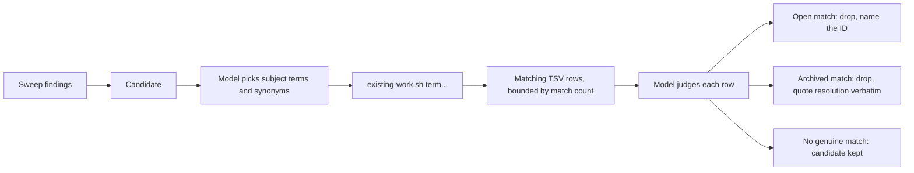
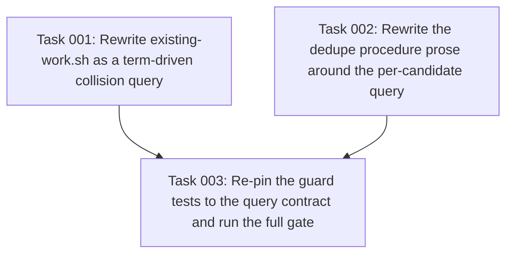

# Plan: Per-candidate collision query for the sift-prime dedupe corpus

## Original Work Order

> I am seeing an obscene token usage when using Sift. I suspect it is related to the output of `existing-work.sh` for projects where sift has done a LOT of work. Investigate and interview me.

## Plan Clarifications

| Question | Answer |
| --- | --- |
| Where is the token usage observed? | A long-running consumer project (`field_union`, 337 tickets, 296 done). A screenshot shows `existing-work.sh` emitting 618.9KB in one Bash call. The harness truncated it to a spill file and the priming agent fell back to ad-hoc filtered grep. |
| Do we need the script at all? | Challenged from first principles. Resolution: the "print everything" contract is the flaw, not the script. The hardened front-matter reads, root resolution, and gitignore-aware `find` in `lib.sh` are worth keeping in one place. |
| What should the new contract be? | The user proposed a per-candidate question: "does this candidate collide with prior work?". Agreed shape: the model passes search terms, the script returns the matching tickets as full 5-field TSV rows (not bare IDs), and the model judges the rows. |
| Backwards compatibility of the no-argument form? | None. A bare `existing-work.sh` becomes a usage error. The full dump ceases to exist. |
| Also tighten the README spec's `resolution` guidance? | No. Scope is the script contract, the dedupe procedure, and the tests. The README ticket schema is untouched, so no spec migration is needed. |

## Executive Summary

`existing-work.sh` prints one TSV line for every ticket under `open/` and `archive/`, with each archived row carrying its full `resolution` text verbatim. The archive is append-only, so this output grows for the life of a project. On a heavy consumer project it reached 618.9KB, which the agent harness truncated. The dedupe procedure that the dump exists to serve, comparing every candidate's subject matter against the whole corpus, therefore never actually ran at that scale. The priming agent quietly degraded to filtered grep instead.

This plan inverts the script's contract. Instead of answering "what is all prior work?", it answers "does this candidate collide with prior work?". The caller passes one or more search terms, the script matches them case-insensitively against ticket titles and bodies in both buckets, and prints only the matching tickets' rows in the existing 5-field TSV shape. Output cost now scales with the number of matches, which is small and does not grow with project age. The row shape is unchanged, so the parts of the dedupe procedure that consume a row (name the open ID, quote the archived `resolution` verbatim) work as before.

The division of labor is deliberate. A shell script can only match text, and "compare subject matter, not just title" is a semantic judgment. So the model chooses the terms, including synonyms for the candidate's subject, and the model judges the rows that come back. The script does the bounded mechanical part in between. The dedupe procedure in `references/analysis.md` is rewritten around this loop, and it states plainly what an empty result proves: no lexical match for those terms, not the absence of a duplicate.

## Context

### Current State vs Target State

| Current State | Target State | Why? |
| --- | --- | --- |
| `existing-work.sh` takes no arguments and dumps every ticket in `open/` and `archive/` | The script requires one or more search terms and prints only matching rows; no arguments is a usage error | The dump grows without bound (618.9KB observed) while the query result is bounded by match count |
| Archived rows carry their full multi-sentence `resolution` in every dump, for every ticket | `resolution` reaches the caller only on the rows that matched a candidate | The verbatim quote is only needed for actual collisions; today ~296 resolutions are shipped to serve two or three quotes |
| The dedupe procedure tells the orchestrator to compare every candidate against the whole corpus in its own context | The procedure queries once per candidate with model-chosen terms and judges only the returned rows | At scale the corpus is truncated before the model sees it, so the procedure's promised comparison silently does not happen |
| `tests/scripts/prime-backlog.test.sh` pins the full-dump behavior; `tests/scripts/root-resolution.test.sh` sweeps the script with no argument | Both tests exercise the query contract; the sweep entry carries a term | The tests are the guard on the contract, so they must pin the new one, including the no-argument error |

### Background

The evidence comes from a live sift-prime run on the `field_union` project. The Bash call that ran `existing-work.sh` produced "Output too large (618.9KB)", the harness saved it to a spill file, and the agent re-ran the script piped through a subject-term grep to get something usable. That fallback is the tell: the ad-hoc filtered grep is already the de-facto dedupe mechanism on heavy projects, but with nobody having decided that and nothing documenting what an empty grep means. This plan makes that mechanism the designed one, with the term choice and the judgment assigned to the model explicitly.

The `resolution` column dominates the dump. The spec (README.md, ticket front-matter) requires a non-empty one-line `resolution` on archived tickets but sets no length bound, and in practice agents write multi-sentence paragraphs on one line, roughly 1.8KB per row on the observed project. The interview considered bounding `resolution` in the spec and rejected it: the query contract already caps what reaches the caller, and a spec change would drag in a migration obligation for no additional benefit.

Constraints that bind the implementation:

- The 5-field TSV row (`id`, `status`, `type`, `title`, `resolution`, tab-separated, control characters squashed to spaces) is pinned by `tests/scripts/prime-backlog.test.sh` and stays the output shape.
- Recipes and shipped helpers must run on GNU and BSD userlands (AGENTS.md). No `sed -i`, no `xargs -r`, `[[:space:]]` in awk.
- The repo's kenkeep nodes bind the CLI grammar (`--` ends the option list and must be honored with a second loop, not a bare `break`) and the grep idiom (`grep` exits 1 on no match; absorb only status 1, never `|| true`).
- `tests/scripts/root-resolution.test.sh` runs every lib-sourcing script with "the minimum arguments that get it past its own usage check". Its sweep entry for `existing-work.sh` currently passes nothing and must gain a term.

## Architectural Approach

The change has three parts that must land together: the script's new contract, the procedure that calls it, and the tests that pin both.

### Query contract in existing-work.sh

**Objective**: Replace the unconditional dump with a term-driven search whose output is bounded by the number of matching tickets.

The script accepts one or more positional terms. Zero terms prints a usage message to stderr and exits with the setup-error code, consistent with how the script family already signals "the invocation is wrong, not the work". An `--` end-of-options marker is honored ahead of the terms so a term beginning with a hyphen is expressible, following the repo's CLI grammar nodes (second-loop pattern, never a bare `break`).

Matching is case-insensitive fixed-string search, OR across terms, applied to the whole ticket file (front matter and body) under both `open/` and `archive/`. Whole-file scope was chosen over title-only during the interview: a ticket whose title does not carry the subject words is exactly the false negative worth paying a little noise to avoid, and the model filters noise when it judges the rows. A file matching any term contributes exactly one output row.

Output rows keep today's exact shape: 5-field TSV, one line per matched ticket, control characters squashed to one space each, sorted by ID. No matches prints nothing and exits 0, mirroring the current empty-backlog behavior. The grep step must absorb only exit status 1 (no match) and let status 2 (real error) propagate, per the kenkeep shell node. The existing `lib.sh` root resolution, `SIFT_ROOT`/`SIFT_PREFIX` overrides, and gitignore-aware `find` are reused unchanged; the header comment is rewritten to describe the query contract.

### Dedupe procedure rewrite

**Objective**: Make the per-candidate query the documented dedupe mechanism and assign the semantic judgment to the model explicitly.

The Dedupe section of `src/skills/sift-prime/references/analysis.md` is rewritten. The loop it prescribes: for each candidate that survived the evidence bar, the orchestrator picks search terms covering the candidate's subject including synonyms and adjacent vocabulary, runs one query, and judges the returned rows. An open row that covers the candidate drops it, naming the open ID in the slate. An archived row that covers it drops it, quoting the `resolution` verbatim, `wontfix` included. Rows that share words but not subject are discarded by the model, which is the point of returning rows rather than a verdict.

The procedure must state the epistemics of an empty result: it proves no ticket contains those terms, not that no duplicate exists. The mitigation is in the term choice, and the procedure says so, instructing more than one term and vocabulary the candidate's author did not use. This replaces the current text's promise of a full-corpus subject comparison, a promise the observed run shows is broken at scale anyway.

`SKILL.md` changes in the same pass: the script listing comment (currently "every open + archived ticket, tab-separated, for dedupe") describes the query, and the cold-tree gotcha ("prints nothing and exits 0 for a cold tree") is reworded since empty output now also means "no match", with the no-terms invocation now being an error rather than the cold-tree probe. Any `@PIN` lines affected by reworded headings are updated in the same change, since `tests/static/skill-prose-pins.test.sh` fails on stale pins.

### Test updates

**Objective**: Re-pin the guard tests to the query contract, including the behaviors that did not change.

In `tests/scripts/prime-backlog.test.sh`, the existing-work cases become query cases. Preserved assertions: 5-field width on every row, ID sort, tab/CR squashing, the open-versus-archived `resolution` distinction, and empty output with exit 0, now for the no-match case as well as the empty tree. New assertions: a term matches in the body when the title lacks it, matching is case-insensitive, multiple terms OR together, a hyphen-leading term works behind `--`, and zero terms exits with the usage error and prints nothing on stdout. Per the repo's testing nodes, each new case needs its positive control, a fixture where the behavior demonstrably fires.

In `tests/scripts/root-resolution.test.sh`, the `existing-work.sh` sweep entry gains a term so the script passes its own usage check and the shared-lib failure stays the thing under test.

`tests/run.sh` is the completion gate for the whole change, shellcheck included.

## Risk Considerations and Mitigation Strategies

Technical Risks

- **Lexical false negatives**: a duplicate phrased in different vocabulary returns no rows, and a duplicate ticket gets filed.
    - **Mitigation**: the procedure requires multiple model-chosen terms including synonyms, and documents that an empty result is not proof of novelty. This is not a regression: on heavy projects the current design truncates before comparison, so lexical-first is already the real behavior, now with the term choice made deliberately.
- **Whole-file matching noise**: body search can return rows that merely mention the subject (for example a `depends_on` neighbor or a cross-reference).
    - **Mitigation**: rows, not verdicts. The model discards non-collisions when judging, and match counts stay small enough that the noise costs little.
- **Portability of the match pipeline**: BSD and GNU grep differ at the edges, and `set -o pipefail` turns grep's no-match status 1 into a pipeline failure.
    - **Mitigation**: fixed-string case-insensitive matching with one `-e` per term is portable; absorb exit status 1 only, per the kenkeep shell node; `tests/run.sh` runs the portability scans.

Implementation Risks

- **Stale prose or pins**: SKILL.md, analysis.md, and the script header all describe the old contract, and `@PIN` lines plus `tests/static/skill-prose-pins.test.sh` fail on drift.
    - **Mitigation**: script, prose, and tests change in one pass, and the static suite in `tests/run.sh` is the gate.
- **Consuming repositories hold the old script**: skills ship into consumer trees, so existing installs keep the dump until re-installed.
    - **Mitigation**: the script writes nothing and its callers ship alongside it in the same skill directory, so old installs stay internally consistent. New installs get the new contract. No data migration exists because no data changes shape.
- **A hidden caller of the dump**: some prompt or recipe outside the audited set might rely on no-arg output.
    - **Mitigation**: the investigation grepped the repository; callers are sift-prime's own prose and the two test files, all updated here. The no-arg usage error makes any missed caller fail loudly rather than silently dumping.

## Success Criteria

### Primary Success Criteria

1. On a fixture tree with many archived tickets carrying long resolutions, a query returns only the rows matching its terms, and the no-match and empty-tree cases print nothing with exit 0.
2. `existing-work.sh` with zero terms prints a usage message to stderr, prints nothing to stdout, and exits with the setup-error code.
3. The Dedupe section of `references/analysis.md` contains no instruction to read the whole corpus, prescribes per-candidate queries with model-chosen terms and model judgment of rows, and states what an empty result does not prove.
4. `tests/run.sh` passes, including the reworked prime-backlog cases, the root-resolution sweep, shellcheck, and the static prose-pin checks.

## Self Validation

1. Build a throwaway tree with `make_tree`-style fixtures: at least 30 archived tickets whose `resolution` values are multi-sentence lines of about 1.5KB, plus a handful of open tickets. Run the old invocation shape (no terms) and confirm the usage error. Run a query for a term present in exactly two tickets and confirm exactly two rows, byte-count the output, and confirm it is under 1KB where the old dump would have been tens of KB.
2. Run a query for a term that appears only in a ticket's body, not its title, and confirm that ticket's row is returned. Run the same term uppercased and confirm the same row. Run two terms hitting disjoint tickets and confirm the union. Run a term prefixed with a hyphen behind `--` and confirm no option-parsing error.
3. Run `tests/run.sh` from the repository root and confirm the summary reports no failures and names no skipped check introduced by this change.
4. Grep `src/skills/sift-prime/` for "corpus", "every open + archived", and "dedupe" and read each hit to confirm no remaining prose instructs dumping or reading the full backlog.
5. Run `src/skills/sift-drain/scripts/ticket-check.sh` only if this session touched any tracker file; this plan should touch none, so confirm `git status` shows changes only under `src/`, `tests/`, and `.ai/strikethroo/`.

## Documentation

- Rewrite the header comment of `src/skills/sift-prime/scripts/existing-work.sh` to document the query contract, the term semantics, and the exit codes.
- Update `src/skills/sift-prime/SKILL.md`: the Scripts listing line for `existing-work.sh` and the cold-tree gotcha bullet.
- Rewrite the Dedupe section of `src/skills/sift-prime/references/analysis.md` as described above.
- No change to README.md or AGENTS.md: the script is not part of the shipped convention's cookbook, and the interview fixed the ticket schema as out of scope.

## Resource Requirements

### Development Skills

- Portable bash and awk under the repo's GNU/BSD rules, including the grep exit-status and `--` handling idioms recorded in the kenkeep `shell/` and `cli/` branches.
- Familiarity with this suite's test harness conventions (`tests/README.md`, positive controls, the shared-lib sweep in root-resolution).

### Technical Infrastructure

- The Unix userland already on the machine. The convention forbids depending on any installable binary, and this change introduces none.

## Integration Strategy

The script, its calling prose, and its tests all live inside the sift-prime skill and this repository's test suite, and they change in one commit so no intermediate state exists where prose and script disagree. Consuming repositories pick the change up when the skill ships to them; because the script is read-only and its only callers travel with it, no coordination or data migration is required. `sift-drain` does not call `existing-work.sh` and is unaffected.

## Notes

- Out of scope, per the interview: any bound on `resolution` length in the spec, any change to the ticket schema or archive layout, any new script, and any change to sift-drain.
- The observed 618.9KB dump also shared its Bash call with `MILESTONES.md`, the `open/` tree listing, and the sift README; the priming agent attributed the bulk to `existing-work.sh` rows. Nothing in this plan depends on that attribution being exact to the byte, since the archive-proportional term is the only unbounded one.

## Execution Blueprint

**Validation Gates:**
- Reference: `/config/hooks/POST_PHASE.md`

### Dependency Diagram

### ✅ Phase 1: Script and prose rewrite
**Parallel Tasks:**
- ✔️ Task 001: Rewrite existing-work.sh as a term-driven collision query — completed
- ✔️ Task 002: Rewrite the dedupe procedure prose around the per-candidate query — completed

### ✅ Phase 2: Test re-pinning and full gate
**Parallel Tasks:**
- ✔️ Task 003: Re-pin the guard tests to the query contract and run the full gate (depends on: 001, 002) — completed

### Post-phase Actions

- Run `tests/run.sh` from the repository root; it is the completion gate for every phase-2 claim.

### Execution Summary
- Total Phases: 2
- Total Tasks: 3

## Execution Summary

**Status**: ✅ Completed Successfully
**Completed Date**: 2026-09-01

### Results

- `src/skills/sift-prime/scripts/existing-work.sh` is now a per-candidate collision query: one or more required search terms, case-insensitive fixed-string OR matching over the whole ticket file in `open/` and `archive/`, one 5-field TSV row per matched ticket sorted by ID. Zero terms and empty terms are usage errors (exit 2, usage on stderr); no match and a cold tree print nothing and exit 0. `--` ends the option list via the second-loop pattern; grep exit status 1 is absorbed, status ≥ 2 aborts the query so a half-read tree can never report "no collision".
- The Dedupe section of `references/analysis.md` prescribes the per-candidate loop (model-chosen terms with synonyms, one query, model judgment of rows) and states the empty-result epistemics. `SKILL.md`'s script listing, exit-2 sentence, and empty-output gotcha describe the query contract.
- `tests/scripts/prime-backlog.test.sh` re-pins the contract (19 cases, 76 assertions, each new case with a positive control and mutation-probe evidence); `tests/scripts/root-resolution.test.sh`'s sweep entry carries a term.
- Scale evidence from Self Validation: on a 30-archived-ticket fixture with ~1.5KB resolutions, a two-ticket query returns 65 bytes where the old dump equivalent is ~71KB.
- `tests/run.sh`: 38 files, 583 tests, 2300 assertions, 0 failures, 5 pre-existing skips.

### Noteworthy Events

- Review gate: `reviewed` / `review-recorded` on the `cursor` harness against base commit 50148b2. Detail: "The reviewer raised no findings." Finding counts: total 0 (critical 0, major 0, minor 0, info 0). All five changed files plus the plan artifacts were viewed. Nothing to act on or ignore.
- The phase-1 implementer added an empty-term refusal beyond the plan's letter: `grep -F -e ""` matches every file, so an unset caller variable would silently resurrect the unbounded dump this plan removes. Pinned by its own test case in phase 2.
- The phase-1 implementer found a latent blind assertion in `tests/scripts/prime-backlog.test.sh`: `prime_ids` ran inside a command substitution, so the `R_STATUS` it set never escaped the subshell and the cold-tree allocator check measured the previous case's status. Fixed at the root in phase 2 (status escapes through a file) with mutation-probe proof, rather than re-baselined.
- Per convention (kenkeep `practice-do-not-add-ai-attribution-trailers-to-commit-messages`), phase commits carry no AI attribution trailer.
- The heading "When the corpus and the sweep disagree" in `analysis.md` keeps the word "corpus"; it describes stale open tickets, not a dump, so it was left alone per the plan's scope rule.

### Necessary follow-ups

- Optional vocabulary cleanup: retitle "When the corpus and the sweep disagree" in `analysis.md` now that the corpus concept is gone. Cosmetic; out of this plan's scope.
- Consuming repositories pick up the new contract when the sift-prime skill next ships to them; old installs stay internally consistent, so no coordination is required.
