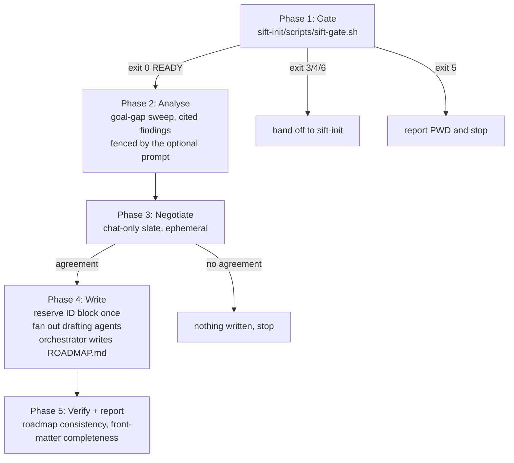
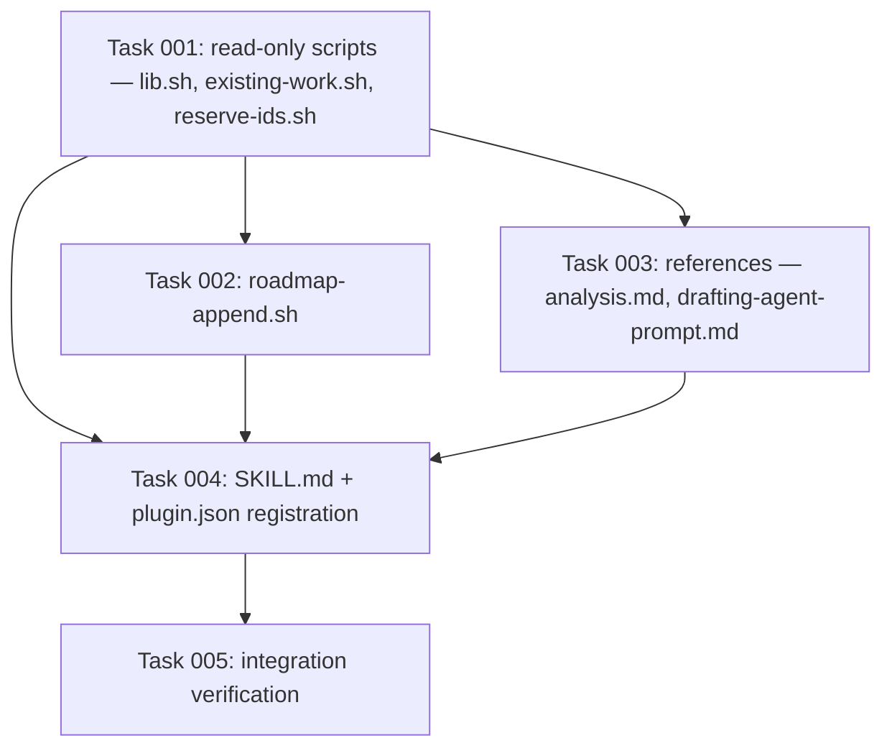

# Plan: `sift-prime` — prime a sift backlog with tickets

## Original Work Order

> Implement a new `sift-prime` skill at src/skills/sift-prime/ (registered in .claude-plugin/plugin.json alongside sift-init and sift-drain). Confirmed intent from interview:
>
> OUTCOME: a card that turns a repo — empty sift tree or populated one — into sift *tickets* on disk, waved and depends_on-wired, ready for /sift-drain to pull. It fills the gap between sift-init (creates the tree) and sift-drain (empties it).
>
> CONFIRMED MECHANICS:
> - Gate: runs sift-init's scripts/sift-gate.sh first, like every sift card; exit 0 continue, 3/4/6 hand off to sift-init, 5 report $PWD and stop.
> - Runs on both cold and populated trees via one code path. Dedupes proposals against BOTH open/ and archive/ — re-proposing something already closed wontfix is the trust-killer failure mode.
> - Analysis basis: the gap between the project's stated intent (README.md / AGENTS.md / MILESTONES.md) and what is actually on disk. Every proposal must cite file:line or `absent: <path>`. No uncited proposals.
> - Optional user prompt is a HARD SCOPE FENCE: it constrains where the analysis looks; out-of-fence findings get one closing line, never tickets. The evidence bar is unchanged by the prompt. Absent a prompt, full-breadth sweep.
> - Negotiation with the user is CHAT-ONLY and ephemeral. Explicitly NO scratch file, no .prime/ directory, no persisted slate. The slate dies with the session.
> - Volume: NO floor, NO quota, NO counting. Plurality is enforced purely by wording — the card must consistently say "tickets"/"issues", never "a ticket"/"an issue". Focusing on a single ticket is the anti-pattern.
> - Sequencing: the primer owns wave grouping, depends_on wiring, and ROADMAP.md rows, written in the same change as the tickets (rule 9).
> - Writing: the orchestrator reserves the whole contiguous ID block up front in ONE pass (single allocator, no race — IDs are sequential, immutable, never reused), then fans out sub-agents each handed its own pre-assigned ID, path and slate row to draft the body against the type's XSD in .ai/sift/schemas/. Orchestrator writes ROADMAP.md itself at the end. Orchestrate, never implement.
>
> OUT OF SCOPE: implementing any ticket, git commit, git push, touching an external tracker, persisting the slate.
>
> CONSTRAINTS FROM AGENTS.md THAT APPLY: no installable binaries — recipes use only the baseline Unix userland, portable across GNU and BSD; `sed -i` and `xargs -r` are banned outright; awk character classes written [[:space:]]. Any helper scripts go in src/skills/sift-prime/scripts/ following the pattern of sift-drain/scripts (root resolution by walking up for .ai/sift/ROADMAP.md, SIFT_ROOT/SIFT_PREFIX overrides). Match the prose voice and SKILL.md frontmatter style of the existing sift-init and sift-drain cards.

## Plan Clarifications

| Question | Answer |
|---|---|
| Backwards compatibility required? | **No BC surface exists.** `sift-prime` is a new, additive card. It reads the convention and writes tickets that already conform to it; it changes no existing file format, no front-matter key, and no script contract. The only edit to an existing file is adding one array entry to `.claude-plugin/plugin.json`. |
| Does this change the normative spec (`README.md`)? | **No.** `sift-prime` introduces no new front-matter key, no new `type` value, and no layout change. Per AGENTS.md, a spec edit would be an API change requiring a migration recipe; nothing here reaches that bar. |
| Cold-tree state | This repository's own `.ai/sift/` is absent in a fresh checkout (the tree is gitignored). Every script must therefore be verifiable against a throwaway tree materialized by `sift-init`, not against a tree assumed to be present. |

## Executive Summary

`sift-init` creates an empty sift tree and `sift-drain` empties one; nothing fills it. Priming a backlog is hand work today: read the project, decide what should happen, allocate IDs one at a time, hand-write a dozen ticket files, then hand-edit `ROADMAP.md` to match. This plan adds `sift-prime`, the third card in the plugin, which does exactly that job and hands `sift-drain` a roadmap it can dispatch immediately.

The card's shape follows the two cards that already exist. It opens with `sift-init`'s deterministic gate so all three agree on where `.ai/sift` lives. It then runs a **goal-gap analysis** — the distance between what the project's own documents claim it is and what is actually on disk — with a hard evidence bar: every proposal cites `file:line` or `absent: <path>`, so the slate cannot fill with plausible-sounding invented work. Proposals are deduped against **both** `open/` and `archive/` before the user ever sees them, because re-proposing something already closed `wontfix` is the failure that makes the card untrustworthy. The user negotiates the slate in chat, ephemerally, with nothing written to disk until agreement.

Writing is orchestrated, never done inline. The orchestrator reserves the entire contiguous ID block in one pass — one allocator, no race, because a split ID space is the one error no `find`/`sed` migration can unpick — then fans out drafting sub-agents, each holding its own pre-assigned ID, target path and slate row, drafting against the type's XSD. The orchestrator writes `ROADMAP.md` itself at the end, in the same change as the tickets, satisfying rule 9.

## Context

### Current State vs Target State

| Current State | Target State | Why? |
|---|---|---|
| `.claude-plugin/plugin.json` ships two cards: `sift-init`, `sift-drain` | Ships three: `sift-init`, `sift-prime`, `sift-drain` | The lifecycle has a hole between "tree exists" and "work the roadmap" |
| Filling a backlog is unassisted hand work | A card runs the analysis, negotiates, and writes tickets plus roadmap rows | The hand path allocates IDs one at a time and reconciles `ROADMAP.md` by eye — both are exactly what the repo's scripts exist to prevent |
| ID allocation happens per ticket, at write time | The whole block is reserved in one pass before any drafting starts | Concurrent drafting agents each allocating "highest + 1" collide, and duplicate IDs are unrecoverable under rule 2 |
| No deterministic view of what has already been proposed and rejected | `existing-work.sh` prints every ticket's ID, status, type, title and resolution across both buckets | Dedupe against `archive/` is the difference between a card the user trusts and one they stop running |
| Appending roadmap rows is manual markdown surgery | `roadmap-append.sh` appends a row to a wave section, creating the section when absent | Rule 9 correctness for a dozen rows across several waves is not a by-eye job |

### Background

Constraints inherited from `AGENTS.md` and the normative `README.md`, all load-bearing here:

- **Ticket IDs are immutable, sequential, never reused, and globally unique across both buckets.** This is what forces the single-allocator design.
- **Rule 9:** creating a ticket and slotting it into `ROADMAP.md` is ONE change. New waves are appended; existing wave rows are never renumbered.
- **Rule 8:** a new milestone must be documented in `MILESTONES.md` in the same change that introduces it, and needs its matching `open/<milestone>/` folder.
- **`type` is a closed set:** `bug | hardening | feature | test | docs | dx | release`. The category folder mirrors it.
- **Portability is not optional.** Baseline Unix userland only. `sed -i` is banned outright (GNU and BSD disagree on the suffix argument, and the BSD form eats the script); `xargs -r` is banned (GNU extension). `awk` character classes are written `[[:space:]]`, never `[ \t]`, because a strict `awk` reads the latter as `{space, backslash, t}` and silently eats the leading `t` of a title.
- **`.ai/sift` is gitignored by default,** so ignore-aware search returns nothing from it. Scripts use `find` plus `command grep`.
- **The XSD schemas are drafting scaffolding, never storage.** Drafting agents render markdown by hand; nothing may depend on `xmllint`.

Two facts about this repository shape the verification approach: `.ai/sift/` does not exist in a fresh checkout, and `.claude-plugin/plugin.json` is the sole registry of shipped cards.

## Architectural Approach

`sift-prime` is a five-phase card. Phases 1–3 write nothing; phase 4 writes everything; phase 5 verifies.



### Card layout

```
src/skills/sift-prime/
├── SKILL.md                          ← the playbook
├── references/
│   ├── analysis.md                   ← sweep dimensions, evidence bar, dedupe, scope fence
│   └── drafting-agent-prompt.md      ← canonical per-ticket drafting sub-agent prompt
└── scripts/
    ├── lib.sh                        ← root/prefix resolution (sourced, never executed)
    ├── existing-work.sh              ← the dedupe corpus, both buckets
    └── reserve-ids.sh                ← the contiguous ID block, one allocator
```

`scripts/lib.sh` is a **deliberately slimmer sibling** of `sift-drain/scripts/lib.sh`, not a copy of it and not a shared import. `sift-drain` depending on `sift-init`'s gate is a contract that card states about itself ("every other sift card calls the gate here"); no equivalent contract exists for its `lib.sh`, and skills are installed independently (`skills-lock.json` tracks them one by one). `sift-prime` needs only root resolution, prefix resolution and `fm_value`; it carries those and nothing else. `roadmap_rows`, `fm_labels`, `ticket_file` and `ticket_search_dirs` are not copied.

### Phase 1 — The gate

Identical contract to `sift-drain`'s opening: run `sift-init`'s `scripts/sift-gate.sh`, resolve its absolute path once, and branch on the exit code. `0` continues; `3`, `4` and `6` hand off to `sift-init` (4 and 6 ask the user first); `5` reports the `$PWD` it walked from and stops. The root is never resolved by eye and the tree is never initialized by this card.

### Phase 2 — Goal-gap analysis

**Objective**: produce cited candidate work, and nothing invented.

The analysis measures one gap: what the project's own documents say it is, against what is on disk. Sources of stated intent, in order: the repository `README.md`, `AGENTS.md` / `CLAUDE.md` and anything they include, `.ai/sift/MILESTONES.md`, and any knowledge base the project ships.

Two hard rules the card states and the drafting phase enforces:

- **Every proposal carries evidence** — a `file:line` citation for a claim about code that exists, or `absent: <path>` for a claim about something that does not. A proposal that cannot cite either is dropped, not softened. This is the same bar the convention already sets for ticket bodies (`## Evidence`, rule 5); enforcing it at proposal time means it cannot be retrofitted later by a drafting agent that never saw the code.
- **The optional user prompt is a hard scope fence, never a priority hint.** Fenced, the sweep looks only inside the fence and findings outside it are reported as a single closing line, never proposed as tickets. Unfenced, the sweep runs full breadth. The fence moves where the analysis looks; it never lowers the evidence bar.

Analysis runs as read-only sub-agents, one per dimension of the sweep (or per slice of the fence), each returning cited findings only. The orchestrator reads their reports, never the source. A full-repository sweep done inline would both bury the orchestrator's context and break the same orchestrate-never-implement discipline `sift-drain` holds.

**Dedupe runs before the user sees anything.** `existing-work.sh` prints the corpus; every candidate is checked against it and one of three things happens: dropped as already open, dropped as already terminal (with the archived ticket's `resolution` quoted to the user as the reason), or kept. Re-proposing an archived `wontfix` is called out in the card as the failure mode that ends the user's trust in the run.

### Phase 3 — Chat-only negotiation

**Objective**: reach agreement without writing anything.

The slate is presented in chat and revised in chat. **No scratch file, no `.prime/` directory, no persisted slate** — the card says so explicitly, because the obvious "helpful" addition is exactly the thing that was rejected. The trade-off is stated plainly in the card: an interrupted session loses the slate and the analysis is re-run.

Plurality is carried by wording alone. The card says *tickets* and *issues* throughout and never *a ticket* or *an issue*; no floor, no quota, no count is ever stated or checked. The anti-pattern the card names is converging on a single ticket.

Presented per candidate: title, `type`, `priority`, `effort`, the one-line why, and the evidence. Presented for the slate as a whole: the proposed wave grouping and the `depends_on` edges, which are negotiated like everything else.

Milestones default to those already in `MILESTONES.md`. When the agreed slate genuinely spans work that has no milestone, the primer proposes one, and on agreement writes the `MILESTONES.md` entry and the `open/<milestone>/` folder in the same change as the tickets (rule 8).

### Phase 4 — Reserve, fan out, write

**Objective**: land the tickets and the roadmap rows as one change, with exactly one ID allocator.

1. **Reserve.** `reserve-ids.sh <count>` runs once and prints the contiguous block, one `<PREFIX>-NNNN` per line. It takes the maximum of the highest ID found across both buckets and the highest ID mentioned in `ROADMAP.md`, then counts up. Reading the roadmap as well as the tree is cheap insurance: an ID present in one and not the other means the tree is mid-repair, and allocating over it would be unrecoverable.
2. **Fan out.** One drafting sub-agent per ticket, each handed its pre-assigned ID, its absolute target path, its slate row with the evidence, its `depends_on` edges, and the XSD root element for its type. Agents draft against the schema into a scratch file outside `.ai/sift/`, render markdown by hand, write the ticket, and return a short structured report. They allocate nothing and touch no file but their own.
3. **Roadmap.** The orchestrator appends the rows itself with `roadmap-append.sh`, after every drafting agent has returned. Appending centrally is what keeps rule 9 satisfiable: a dozen agents appending to one file is the shared-mutable-file shape `AGENTS.md` tells us to avoid.

### Phase 5 — Verify and report

The card runs the roadmap consistency check and the front-matter completeness check from the tree's own `.ai/sift/README.md` cookbook — dogfooding the spec rather than duplicating its logic into a fourth script. The final report states the IDs written, their wave grouping, and the single closing line for out-of-fence findings when the run was fenced. It ends by naming `sift-drain` as the next step and states plainly that nothing was committed.

### Registration

`.claude-plugin/plugin.json` gains `"./src/skills/sift-prime"`. Ordering in that array follows the lifecycle: init, prime, drain.

## Risk Considerations and Mitigation Strategies

<details>
<summary>Technical Risks</summary>

- **Duplicate or colliding ticket IDs.** Under rule 2 IDs are immutable and never reused, so a collision cannot be repaired by renumbering — it is the one error no `find`/`sed` migration unpicks.
    - **Mitigation**: `reserve-ids.sh` is the single allocator, runs once before any drafting agent starts, and reads both the tree and `ROADMAP.md` for the high-water mark. Drafting agents receive their ID as an input and are told in the prompt that they never allocate.
- **Portability breakage on BSD/macOS.** `sed -i` and `xargs -r` are the two known silent killers, and `awk`'s `[ \t]` eats leading `t`s.
    - **Mitigation**: the scripts follow `sift-drain/scripts/lib.sh`'s established idioms verbatim — `sed … > "$f.tmp" && mv`, `| while read -r f; do … done`, `[[:space:]]`. A dedicated review task greps the new scripts for all three banned constructs.
- **`roadmap-append.sh` corrupting an existing roadmap.** It edits a file that is the run's only ordering record.
    - **Mitigation**: it appends only — it never renumbers or rewrites existing rows — writes through a `.tmp` file and `mv`, and creates a `## Wave N` section only when that section is absent. Verified against a materialized throwaway tree with pre-existing rows, not only an empty one.
- **A drafting agent writing a ticket that violates the convention** (missing required key, category folder not matching `type`, milestone not in `MILESTONES.md`).
    - **Mitigation**: the drafting prompt names the required keys, points at the XSD for its type, and states the two rules XSD 1.0 cannot carry. Phase 5 runs the front-matter completeness check across the tree.
</details>

<details>
<summary>Implementation Risks</summary>

- **Scope creep into a persisted slate.** A scratch file is the natural thing to reach for, and it was explicitly rejected.
    - **Mitigation**: the card states the prohibition as a rule with its trade-off, not as an omission, so a later editor cannot read it as an oversight.
- **The card drifting toward single-ticket framing.** The requirement is carried by wording alone, with no mechanical check behind it.
    - **Mitigation**: a dedicated review task greps the finished card for singular ticket phrasing.
- **Prose voice diverging from the two existing cards.** The cards are read as one set.
    - **Mitigation**: `sift-init/SKILL.md` and `sift-drain/SKILL.md` are the style reference; frontmatter follows their `name` + `description` shape with the same trigger-phrase enumeration.
</details>

<details>
<summary>Verification Risks</summary>

- **No sift tree exists in a fresh checkout,** so scripts cannot be verified against the live tree.
    - **Mitigation**: every script task verifies against a throwaway tree materialized with `sift-init/scripts/sift-init.sh` into a temporary directory, driven by `SIFT_ROOT`, and cleans it up afterwards.
</details>

## Success Criteria

### Primary Success Criteria

1. `src/skills/sift-prime/SKILL.md` exists with `sift-init`/`sift-drain`-style frontmatter, and `.claude-plugin/plugin.json` lists all three cards.
2. `scripts/reserve-ids.sh N` prints exactly `N` contiguous zero-padded IDs starting one above the high-water mark of both buckets and `ROADMAP.md`, verified against a materialized throwaway tree.
3. `scripts/existing-work.sh` prints one line per ticket across `open/` and `archive/` carrying ID, status, type, title and resolution, verified against a throwaway tree holding tickets in both buckets.
4. `scripts/roadmap-append.sh` appends a row to an existing wave, creates a `## Wave N` section when absent, and leaves pre-existing rows byte-identical.
5. The finished card contains no `sed -i`, no `xargs -r`, and no `[ \t]` awk character class, and requires no binary outside the baseline Unix userland.
6. The card's prose refers to *tickets* / *issues* and never to *a ticket* / *an issue*, and states no floor, quota or target count.
7. The card states, as explicit rules: the gate's five exit codes, dedupe against both buckets, the `file:line` / `absent:` evidence bar, the prompt as a hard scope fence, the chat-only ephemeral slate, and single-pass ID reservation before fan-out.

## Self Validation

Run these after all tasks complete, from `/workspace`:

1. **Materialize a throwaway tree and exercise every script end to end.**
   ```sh
   T=$(mktemp -d) && mkdir -p "$T/.git" &&
   src/skills/sift-init/scripts/sift-init.sh --root "$T" --prefix TEST
   ```
   Then, with `SIFT_ROOT="$T"`, confirm `src/skills/sift-prime/scripts/reserve-ids.sh 5` prints `TEST-0001` through `TEST-0005`. Hand-write two ticket files into `$T/.ai/sift/open/backlog/bug/` and `$T/.ai/sift/archive/backlog/dx/` with IDs `TEST-0001` and `TEST-0002`, add a roadmap row for each, and confirm `reserve-ids.sh 3` now prints `TEST-0003` through `TEST-0005` and `existing-work.sh` prints both tickets with their status and resolution. Confirm `roadmap-append.sh 1 TEST-0003 "Some title" "TEST-0001"` appends a row under `## Wave 1` and `roadmap-append.sh 2 TEST-0004 "Other title" ""` creates a `## Wave 2` section, with the Wave 1 rows unchanged (`diff` against a copy taken beforehand). Remove `$T`.
2. **Run the tree's own consistency check** from `.ai/sift/README.md` against `$T` before removal and confirm it reports no `NOT IN ROADMAP` or `STALE IN ROADMAP` lines for the tickets and rows created in step 1.
3. **Portability grep** over the new card:
   ```sh
   command grep -rn -e 'sed -i' -e 'xargs -r' -e '\[ \\t\]' src/skills/sift-prime/
   ```
   Expect no matches.
4. **Plurality grep** over the new card:
   ```sh
   command grep -rniE '\b(a|one|single) (ticket|issue)\b' src/skills/sift-prime/
   ```
   Every surviving match must be a deliberate reference to the single-ticket anti-pattern or to one ticket file being one ticket — inspect each and confirm.
5. **Registration check**: confirm `.claude-plugin/plugin.json` parses and lists `./src/skills/sift-prime` alongside the other two, and that every listed path holds a `SKILL.md`.
6. **Shell syntax check**: `bash -n` over every new `.sh` file exits 0, and each executable script carries the executable bit like `sift-drain/scripts/*.sh`.

## Documentation

- **`.claude-plugin/plugin.json`** — required: the card is invisible to the plugin without it.
- **`README.md` (the normative sift spec)** — **not touched.** `sift-prime` adds no front-matter key, no `type` value and no layout change, so nothing here reaches the API-change bar AGENTS.md sets. `src/skills/sift-init/assets/README.md` therefore also stays in sync untouched.
- **`AGENTS.md`** — **not touched.** It governs the convention and how to change it, not the plugin's card inventory, which it never enumerates.
- **kenkeep** — a `map-sift-prime-skill` node would sit naturally beside `map-sift-drain-skill`, but kenkeep nodes are written through `/kk-add` under the user's review. Recorded as a follow-up, not a task.

## Resource Requirements

### Development Skills

Portable POSIX shell and `awk` (GNU and BSD), the sift convention as fixed by `README.md`, and agent-card authoring in the voice of the two existing cards.

### Technical Infrastructure

Baseline Unix userland only — `bash`, `find`, `grep`, `sed`, `awk`, `sort`, `mv`, `mktemp`. `src/skills/sift-init/scripts/sift-init.sh` is used to materialize throwaway trees for verification. No installable dependency is introduced, and none may be.

## Integration Strategy

`sift-prime` sits between the two existing cards and borrows exactly one thing from each: `sift-init`'s gate script, called by absolute path as `sift-drain` already calls it, and `sift-drain`'s script idioms, reimplemented rather than imported. It hands off to `sift-drain` by leaving a roadmap that `next-ticket.sh` can dispatch without further edits. No existing file changes except the plugin manifest.

## Notes

The three rejected alternatives, recorded so they are not re-proposed: a persisted slate file (rejected in the interview — the slate is ephemeral); a ticket-count floor or coverage quota (rejected — plurality is carried by wording alone); and sharing `sift-drain/scripts/lib.sh` across cards (rejected — skills install independently and no card advertises its `lib.sh` as a cross-card contract).

## Execution Blueprint

**Validation Gates:**
- Reference: `/config/hooks/POST_PHASE.md`

### Dependency Diagram



No circular dependencies: the graph is a DAG rooted at task 001 and terminating at task 005.

### ✅ Phase 1: Resolution and allocation primitives
**Parallel Tasks:**
- ✔️ Task 001: Create `lib.sh`, `existing-work.sh` and `reserve-ids.sh` — the card's read-only script surface

### ✅ Phase 2: Roadmap writer and card references
**Parallel Tasks:**
- ✔️ Task 002: Create `roadmap-append.sh`, the card's only writing script (depends on: 001)
- ✔️ Task 003: Write `references/analysis.md` and `references/drafting-agent-prompt.md` (depends on: 001)

### Phase 3: The playbook
**Parallel Tasks:**
- Task 004: Write `SKILL.md` and register the card in `.claude-plugin/plugin.json` (depends on: 001, 002, 003)

### Phase 4: Verification
**Parallel Tasks:**
- Task 005: Verify the finished card end to end against a materialized sift tree (depends on: 001, 002, 003, 004)

### Post-phase Actions

Each phase closes on the criteria in its own task files, verified by running the stated commands — this repository has no test suite, no `package.json` and no `Makefile`, so script execution against a throwaway `sift-init` tree is the only verification available and is mandatory rather than optional. No phase closes on a sub-agent's unaccompanied claim of success.

### Execution Summary
- Total Phases: 4
- Total Tasks: 5
