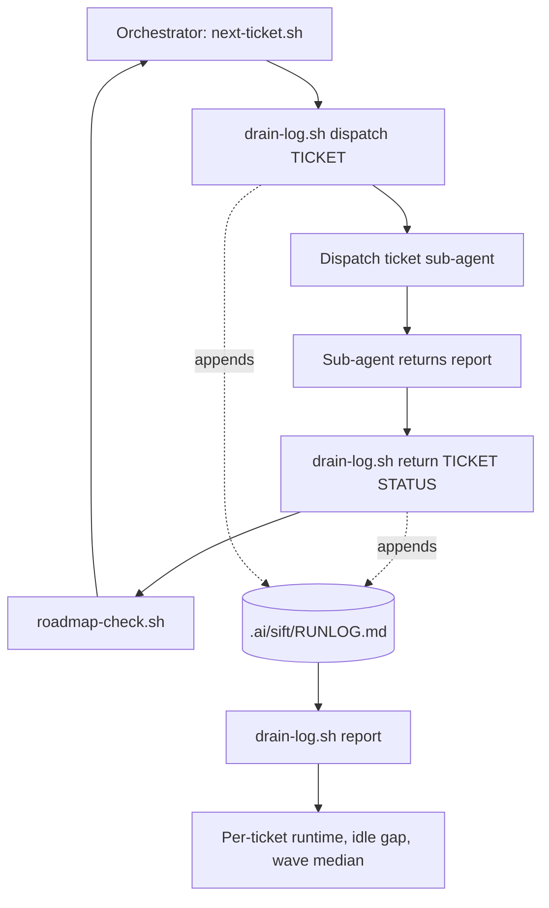
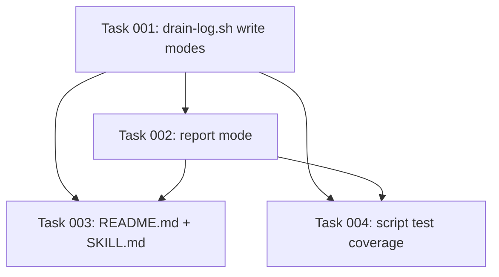

# Plan: Per-ticket time attribution for sift-drain

## Original Work Order

> Work order: sift-drain per-ticket latency tail. Wave 1 of the .ai/sift roadmap ran ten
> tickets with a ~5-minute median, but SFT-0004 (effort: m) took 42 minutes and SFT-0005
> (effort: s) took 39 minutes. Effort does not predict duration (SFT-0006, effort: m, took
> 3 minutes), so this is not ticket sizing. Both slow tickets produced a single commit at
> the very end of their run, so there is currently no way to attribute where the 40 minutes
> went. Phase 1 must be diagnosis: add per-ticket time attribution to the sift-drain
> orchestration (src/skills/sift-drain/) so a drain records where each ticket agent's
> wall-clock goes. Only after that names a cause should any fix be planned. Explicitly out
> of scope: intra-wave parallelism, the wave gate, and sift-prime ticket sizing.

## Plan Clarifications

| Question | Answer |
|---|---|
| What records where a ticket agent's time goes? | Orchestrator stamps a run log. The sub-agent report contract is untouched, and the measurement cannot be misreported by the agent being measured. Accepted limitation: per-ticket totals, not within-ticket phase attribution. |
| Where does the run log live? | Inside `.ai/sift/`, so a resumed or handed-off drain can read its own history. This makes the file part of the tracker layout, which `AGENTS.md` treats as the public API, so `README.md` must document it in the same change. |
| Is backwards compatibility required? | Not applicable. Nothing is renamed or removed. The change is additive: one new file in the tree, one new script. The sub-agent report block ships unchanged. |

## Executive Summary

A sift drain currently leaves no record of its own timing. The only evidence of how long a
ticket took is the interval between merge commits, and that interval is contaminated —
it includes the operator's idle time between dispatches and any connection interruption.
That contamination is not theoretical: the largest apparent outlier in wave 1 (SFT-0010,
114 minutes) turned out to be a dropped connection, not work. Any conclusion drawn from
merge timestamps is therefore unsafe, which blocks diagnosis of the two tickets that were
genuinely slow.

This plan adds the missing measurement and nothing else. A deterministic helper script in
`src/skills/sift-drain/scripts/` appends one row to `.ai/sift/RUNLOG.md` when the
orchestrator dispatches a ticket agent and another when that agent returns. A second mode
of the same script reads the log back and reports, per ticket, the agent runtime, the idle
gap that preceded it, and the wave's median runtime. Runtime and idle become separately
visible for the first time.

The approach was chosen because it is the only one that requires no change to sift-drain's
shipped sub-agent report contract and cannot be distorted by the agent under measurement.
Its deliberate limitation is that it reports totals, not a within-ticket breakdown: it will
say which tickets are slow with trustworthy numbers, not yet why. Naming the cause is the
next work order, and it should be planned against real data rather than against merge
timestamps.

## Context

### Current State vs Target State

| Current State | Target State | Why? |
|---|---|---|
| A drain records no timing at all | The drain appends a dispatch row and a return row per ticket to `.ai/sift/RUNLOG.md` | Timing is the evidence the diagnosis needs and it does not currently exist anywhere |
| Per-ticket duration is inferred from the gap between merge commits | Per-ticket agent runtime is read directly from the log | Merge gaps include operator idle time and connection drops, so they overstate runtime by an unknown amount |
| Operator idle time is indistinguishable from agent runtime | Idle gaps between dispatches are reported as their own quantity | Separating them is the entire point; without it a 40-minute figure cannot be trusted |
| Comparing a ticket against its wave requires manual arithmetic | The report prints the wave median alongside each ticket | The success criterion is stated relative to the wave median, so it must be computed, not eyeballed |
| `README.md` describes the tree without a run log | `README.md` documents `RUNLOG.md` as part of the layout | The tree layout is the public API; adding a file to it without documenting it is an undocumented API change |

### Background

`src/skills/sift-drain/SKILL.md` establishes two invariants this plan must respect.

The first is "orchestrate, never implement": the orchestrator implements nothing, and every
piece of ticket bookkeeping happens inside a sub-agent. Appending a log line is bookkeeping,
so the orchestrator must not write the file itself. The skill already resolves this pattern
for other deterministic work — it calls `next-ticket.sh`, `wave-status.sh` and
`roadmap-check.sh` rather than parsing markdown by eye. A logging helper invoked the same
way is in-pattern and breaches nothing.

The second is the sub-agent report block, which SKILL.md introduces with "Sub-agents return
exactly this". That block is a contract. This plan does not touch it.

`AGENTS.md` adds two hard constraints. Recipes and helpers must run on the Unix userland
already present, in both GNU and BSD forms — `sed -i` and `xargs -r` are banned outright,
and no feature may require an installable binary. And the tree should prefer append-only or
one-file-per-entity shapes over shared mutable files, because concurrent agents may touch
the tree at once. An append-only log satisfies that directly.

The measured wave-1 data that motivates the work, with SFT-0010 excluded as a connection
drop: median ~5 minutes across ten tickets, with SFT-0004 at ~42 minutes and SFT-0005 at
~39 minutes. `effort` does not explain the spread — SFT-0006 carries `effort: m` and
completed in ~3 minutes while SFT-0005 carries `effort: s` and took ~39.

## Architectural Approach

### The run log file

**Objective**: Give a drain a durable, append-only record of its own timing that survives a
session and can be read by the next one.

`.ai/sift/RUNLOG.md` sits at the tree root beside `ROADMAP.md` and `MILESTONES.md`, and
follows their uppercase naming. It is a markdown table: a header written once when the file
is first created, then one row appended per event and never rewritten. Appending a row to
an existing table is a pure append, which keeps the file safe under the concurrent access
`AGENTS.md` warns about, and keeps it readable both as a rendered table and to `awk`.

Each row records the event kind (`dispatch` or `return`), the ticket ID, an ISO-8601 UTC
timestamp for human reading, an epoch-seconds value for arithmetic, and — on `return` rows
— the status the sub-agent reported. Carrying both time representations is deliberate: the
report never has to parse a date back into a number, which is precisely where GNU and BSD
`date` diverge (`date -d` versus `date -v`). Only `date -u +%Y-%m-%dT%H:%M:%SZ` and
`date +%s` are used, and both behave identically on GNU and BSD.

The file is created lazily by the helper on the first dispatch of a drain, not eagerly by
`sift-init`. `sift-init` materializes the structure a tracker needs in order to be a
tracker; a run log is drain output, and an empty one in a freshly initialized tree would be
noise. This also keeps `sift-init` unchanged, which is the smaller change. `sift-init`'s
`write_file` is idempotent and preserves existing files, so a lazily created log is never
clobbered by a later re-init.

### The logging helper

**Objective**: Let the orchestrator record timing without implementing anything, and
without any risk of hand-written log rows drifting from the format the reader expects.

A new `src/skills/sift-drain/scripts/drain-log.sh` provides three modes: `dispatch <TICKET>`
appends a dispatch row, `return <TICKET> <STATUS>` appends a return row, and `report`
reads the log back. It resolves the project root exactly as its sibling scripts do — walking
up from `$PWD` for `.ai/sift/ROADMAP.md`, honouring a `SIFT_ROOT` override — and reuses
`scripts/lib.sh` where that resolution already lives, rather than duplicating it.

Writing goes through the script rather than through the orchestrator's own file tools for
two reasons: it keeps the "never implement" invariant intact, and it makes the row format a
single point of truth that the reader mode can rely on.

### The report

**Objective**: Turn the log into the numbers the success criteria are stated in, so no
manual arithmetic stands between a drain and its diagnosis.

`report` pairs each `dispatch` row with the next `return` row for the same ticket and emits,
per ticket: agent runtime (return minus dispatch), the idle gap that preceded the dispatch
(dispatch minus the previous return), and the status. It then prints the median runtime
across the tickets in the log and flags any ticket whose runtime exceeds an order of
magnitude over that median — which is the success criterion stated as a machine check
rather than a judgement call.

All arithmetic is integer arithmetic over the epoch-seconds column in `awk`. Character
classes are written `[[:space:]]`, never `[ \t]`, per the `AGENTS.md` portability rule.

An unpaired `dispatch` row — the signature of exactly the interrupted connection that
produced the misleading SFT-0010 figure — is reported as incomplete rather than silently
given a duration. That case is the reason this work exists; it must not be papered over.

### Spec and orchestration updates

**Objective**: Keep the shipped convention honest about a file that now exists in the tree,
and put the helper into the drain loop at the two points where timing is observable.

`README.md` is normative and ships into consuming repositories as `.ai/sift/README.md`, so
its description of the tree layout gains `RUNLOG.md` with a short statement of its role and
its append-only nature. `src/skills/sift-drain/SKILL.md` gains `drain-log.sh` in its scripts
table and two steps in the per-ticket loop: log the dispatch immediately before dispatching,
log the return immediately after the agent returns and before `roadmap-check.sh`.

## Risk Considerations and Mitigation Strategies

Technical Risks

- **GNU/BSD `date` divergence**: date arithmetic is the classic portability trap, and the
  repo bans the tools that paper over it.
    - **Mitigation**: never parse a timestamp. Store epoch seconds at write time alongside
      the ISO string, and do all arithmetic on the integer column. Only `date -u +%Y-%m-%dT%H:%M:%SZ`
      and `date +%s` are used, both identical across GNU and BSD.
- **Wall-clock is not monotonic**: a system clock adjustment mid-drain would skew or negate
  a duration.
    - **Mitigation**: no portable monotonic clock exists in the target userland, so this is
      accepted rather than solved. `report` treats a negative duration as corrupt and says
      so instead of printing it.
- **Concurrent appends interleaving**: `AGENTS.md` warns that concurrent agents may touch
  the tree.
    - **Mitigation**: one short line per event appended with `>>`, which is the shape the
      convention already prescribes for exactly this reason. No read-modify-write of the
      file ever occurs.
- **Orchestrator-side overhead lands inside the measurement**: the interval between the
  `dispatch` stamp and the sub-agent actually starting is counted as runtime.
    - **Mitigation**: bound it by stamping immediately before dispatch and immediately after
      return, and state the limitation in the report's own output so no reader over-reads a
      number by a few seconds.

Implementation Risks

- **Scope creep into the fix**: the tempting next step is to start making slow tickets
  faster, which this work order explicitly defers.
    - **Mitigation**: the deliverable is measurement and reporting only. No change to how a
      ticket agent works, what it reads, or how it verifies.
- **Breaching the "never implement" invariant**: having the orchestrator append rows itself
  would violate a load-bearing rule of the skill.
    - **Mitigation**: all writes go through `drain-log.sh`, invoked exactly as
      `roadmap-check.sh` already is.
- **Undocumented API change**: adding a file to the tree without updating the spec would
  make the layout and the normative README disagree.
    - **Mitigation**: the `README.md` edit ships in the same change, and the cookbook tests
      that execute blocks extracted from `README.md` run in the same change.

Quality Risks

- **A log nobody can trust**: a report that silently invents a duration for an interrupted
  run would recreate the exact error this work exists to correct.
    - **Mitigation**: unpaired dispatch rows are reported as incomplete, never as a
      duration.

## Success Criteria

### Primary Success Criteria

1. Running a drain produces `.ai/sift/RUNLOG.md` containing exactly one `dispatch` row and
   one `return` row per dispatched ticket, with the return row carrying the reported status.
2. `drain-log.sh report` prints, per ticket, agent runtime and the preceding idle gap as
   separate figures, plus the median runtime across the log.
3. Idle time is provably separable from runtime: with a delay injected between a return and
   the next dispatch, the report attributes that delay to the idle gap and not to any
   ticket's runtime.
4. An unpaired `dispatch` row is reported as incomplete rather than assigned a duration.
5. `README.md` documents `RUNLOG.md` in the tree layout, and `tests/run.sh` passes in full,
   including the cookbook tests that execute blocks extracted from `README.md`.
6. `drain-log.sh` uses no `sed -i`, no `xargs -r`, no `[ \t]` character class, and no binary
   outside the baseline userland.

## Self Validation

Execute these after all tasks complete:

1. Create a scratch tree: `mkdir -p /tmp/sift-runlog-check/.ai/sift` and place a minimal
   `ROADMAP.md` in it so root resolution succeeds. Export `SIFT_ROOT=/tmp/sift-runlog-check`.
2. Append a synthetic run: `drain-log.sh dispatch SFT-9001`, `sleep 2`,
   `drain-log.sh return SFT-9001 done`, `sleep 3`, `drain-log.sh dispatch SFT-9002`,
   `sleep 1`, `drain-log.sh return SFT-9002 done`. `cat` the resulting
   `/tmp/sift-runlog-check/.ai/sift/RUNLOG.md` and confirm four appended rows under one
   header.
3. Run `drain-log.sh report` against that tree. Confirm SFT-9001 reports ~2s runtime,
   SFT-9002 reports ~1s runtime with a ~3s preceding idle gap, and that the 3-second sleep
   appears as idle and is absent from both runtime figures. This is criterion 3.
4. Append an unpaired dispatch: `drain-log.sh dispatch SFT-9003`, re-run `report`, and
   confirm SFT-9003 is reported as incomplete with no duration.
5. Confirm portability by inspection: `grep -n "sed -i\|xargs -r" src/skills/sift-drain/scripts/drain-log.sh`
   returns nothing, and `grep -n '\[ \\t\]' src/skills/sift-drain/scripts/drain-log.sh`
   returns nothing.
6. Confirm the spec is updated: `grep -n "RUNLOG" README.md` returns the layout entry.
7. Run `tests/run.sh` from the repository root and confirm it exits zero with the new script
   coverage included in its reported totals.
8. Remove the scratch tree: `rm -rf /tmp/sift-runlog-check`.

## Documentation

Does this plan need to update the documentation or `AGENTS.md`?

- **`README.md` — yes, required.** It is the normative spec and ships into consuming repos as
  `.ai/sift/README.md`. Adding `RUNLOG.md` to the tree without documenting it there would put
  the layout and its specification out of sync, which `AGENTS.md` classifies as an API change
  made silently.
- **`src/skills/sift-drain/SKILL.md` — yes, required.** The scripts table gains
  `drain-log.sh`, and the per-ticket loop gains the two logging steps.
- **`AGENTS.md` — no.** No convention rule changes. The work is governed by rules already
  written there (append-only shapes, GNU/BSD portability, no installable binaries) rather
  than changing any of them.
- **`tests/README.md` — only if a new test group is introduced.** If the coverage folds into
  the existing script-test group, no edit is needed.
- **kenkeep node — not a deliverable of this plan.** Worth capturing once the log has
  produced its first real measurement and there is a finding to record.

## Resource Requirements

### Development Skills

POSIX shell scripting with strict GNU/BSD portability discipline; `awk` text processing;
technical writing against a normative specification.

### Technical Infrastructure

The baseline Unix userland only — `bash`, `awk`, `date`, `grep`, `find`, `sort`. No new
dependency is introduced, and none may be. Verification runs through the existing
`tests/run.sh`.

## Notes

The accepted limitation of this plan, stated plainly so the next work order starts from it:
this measures per-ticket totals, not a within-ticket breakdown. It will say with trustworthy
numbers which tickets are slow and how much of an apparent delay was really the operator
being away. It will not say whether a slow ticket spent its 40 minutes reading context,
implementing, or verifying. That question needs the sub-agent report contract to change, and
it should be asked only once this log shows the tail is real and reproducible rather than an
artifact of measurement.

## Execution Blueprint

**Validation Gates:**
- Reference: `/config/hooks/POST_PHASE.md`

### Dependency Diagram

The graph is acyclic: task 001 has no dependencies, 002 depends only on 001, and 003 and 004
each depend only on 001 and 002.

### ✅ Phase 1: Fix the log format and write modes
**Parallel Tasks:**
- ✔️ Task 001: Create `drain-log.sh` with its `dispatch` and `return` write modes, establishing
  the `RUNLOG.md` five-column row format every later task consumes. — `completed`

### Phase 2: Read the log back
**Parallel Tasks:**
- Task 002: Add the `report` mode that separates agent runtime from operator idle time
  (depends on: 001)

### Phase 3: Document and cover
**Parallel Tasks:**
- Task 003: Document `RUNLOG.md` in `README.md`, re-sync the `sift-init` asset copy, and wire
  `drain-log.sh` into `SKILL.md` (depends on: 001, 002)
- Task 004: Add `tests/scripts/drain-log.test.sh` and register the script in the shared
  root-resolution sweep (depends on: 001, 002)

Tasks 003 and 004 touch disjoint files — 003 edits `README.md`, the `sift-init` asset copy
and `SKILL.md`; 004 edits `tests/scripts/` only — so they run concurrently without contention.

### Post-phase Actions

`POST_PHASE.md` runs after every phase. Phase 3's completion is followed by
`POST_EXECUTION.md` and the code review gate.

### Execution Summary
- Total Phases: 3
- Total Tasks: 4
