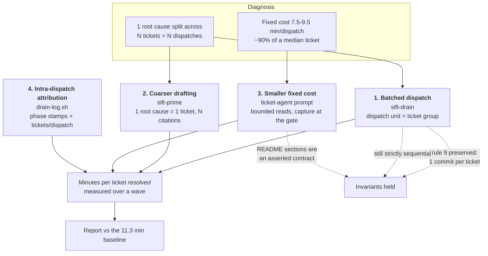
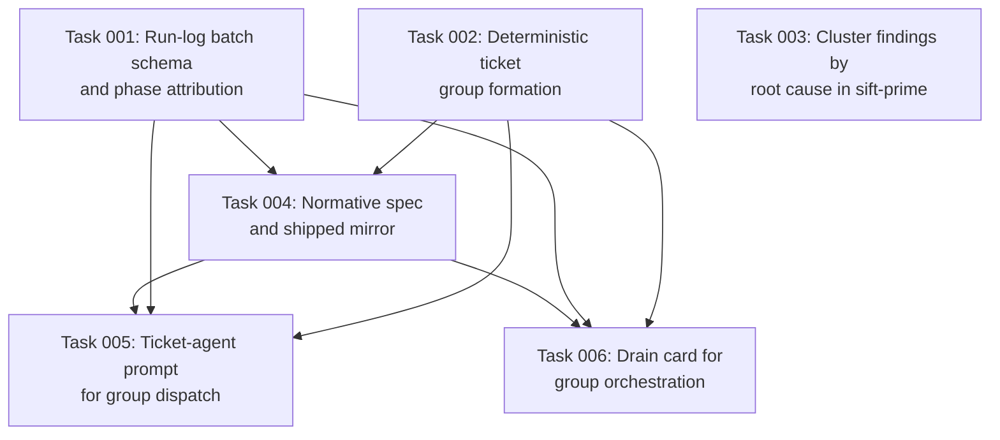

# Plan: Batched Dispatch and Fixed-Cost Reduction for the Sift Drain

## Original Work Order

> I need to make Sift WAY more efficient. It is taking too long to complete tasks that
> should complete faster.
>
> I have tried to implement mitigations: five commits (`1967d8c`, `5a2c2f6`, `a0bc07d`,
> `e78a8fd`, `11725ae`), among others.
>
> However I think that the main problem is that the tickets are too granular and we eat up
> the fixed cost of handling a single ticket too many times.
>
> I want you to investigate and propose. I am basing this on a hunch, not hard data. The
> instrumented data may be affected by internet cuts, laptop going to sleep, etc. So
> consider that when inspecting for outliers.

## Plan Clarifications

| Question | Answer |
|---|---|
| Which levers should the plan pull: batch at dispatch, coarser tickets at drafting, shrink the fixed cost itself, or investigate further first? | All four. The plan carries the three fixes *and* the instrumentation that validates them. |
| Is backwards compatibility required for `README.md` (the normative spec that ships into consuming repos) and the `RUNLOG.md` row format? | No. Pre-1.0 — break freely. No migration recipe is owed to an already-installed tree. |
| What counts as "WAY more efficient"? | No fixed threshold. Measure the before/after honestly and report whatever it lands at. |

## Executive Summary

The hunch is correct and the run log proves it. Regressing agent runtime against total
diff churn across the 21 completed tickets in `.ai/sift/RUNLOG.md` gives a fixed intercept
of **9.5 minutes** over all tickets, or **7.5 minutes** with the two `type: test`
mega-tickets excluded, against a marginal cost of 0.008–0.025 minutes per changed line.
For a ticket of median size — roughly 100 changed lines — that means **about 90% of wall
clock is fixed cost that has nothing to do with the work**. The measured spread makes the
same point without any statistics: SFT-0008 moved 1645 lines at 0.8 seconds per line,
while SFT-0017 moved 57 lines at 14.1 seconds per line. Seventeen-fold, purely from size.

That fixed cost is then paid far more often than the work requires, because the backlog
splits single root causes across many tickets. Five root-cause families account for roughly
17 of the 32 archived tickets — whole-token ID matching, empty-tree guards, front-matter
fence scoping, labels truncated at the first blank, and the end-of-options marker.

*Corrected during execution:* only about two of those five would survive the stricter
one-`## Direction` test that component 2 applies before merging findings into a single
ticket. The whole-token-ID family, for instance, spans README recipes, the XSD and two
different `awk` readers, and needs five different fixes. That trims component 2's reach —
but not component 1's, whose bar is shared *context*, not a shared fix: SFT-0025 and
SFT-0031 both edit `lib.sh`, SFT-0009 and SFT-0015 both edit `README.md`, and one agent's
orientation would have served each pair. The two bars are documented separately for exactly
this reason. The file overlap is the same finding seen from the other side:
**`README.md` was edited by 17 separate tickets** and its `sift-init/assets/README.md`
mirror by 16. Seventeen agents each read the same 811-line, 41 KB file in full, made a
surgical edit, archived a ticket, committed and merged.

This plan attacks both multipliers. It changes the **dispatch unit** from a ticket to a
coherent group of tickets so the fixed cost is paid once per root cause instead of once
per call site; it changes **drafting** so a root cause spanning N sites becomes one ticket
carrying N citations; it **shrinks the fixed cost itself** by bounding what a ticket agent
must read and by relocating per-ticket knowledge capture to the wave gate; and it extends
the run log to **attribute time inside a dispatch**, so all three claims are settled by
measurement rather than argument. Backwards compatibility is not required, so the spec,
the run-log format and the skill cards are all in scope.

## Context

### Current State vs Target State

| Current State | Target State | Why? |
|---|---|---|
| The dispatch unit is one ticket. 21 dispatches for 21 tickets. | The dispatch unit is a coherent ticket **group**. One dispatch resolves every ticket sharing a root cause. | The fixed cost is 7.5–9.5 min per dispatch and ~90% of a median ticket's wall clock. Fewer dispatches is the single largest available saving. |
| A root cause spanning N call sites is drafted as N tickets (5 tickets for whole-token ID matching; 2 for label truncation; 2 for the end-of-options marker, split across two waves). | One root cause drafts as one ticket carrying every site's `file:line` under `## Evidence`. | Splitting by call site multiplies dispatches without adding information. The evidence bar is satisfied by listing the sites, not by splitting the ticket. |
| Every ticket agent reads `.ai/sift/README.md` (811 lines, 41 KB) in full during STEP 1, then usually edits a few lines of it. 17 tickets did exactly this. | The ticket agent reads a bounded, named set of `README.md` sections. Section headings are already a parsed API, so the set is a contract the tests can assert. | Re-reading the whole cookbook to apply rule 9 is the largest single component of the orientation cost, repaid on every dispatch. |
| STEP 9 runs the knowledge-capture skill once per ticket agent, each seeing only its own ticket. | Knowledge capture runs once per wave at the gate, over the wave's collected reports. | Speed *and* correctness. The drain produced 21 nodes; commit `eeb12cb` records that **three were stale on arrival**, each contradicted by work that landed after the node was written. A per-ticket agent cannot see the wave; a gate-level pass can. |
| One branch and one merge commit per ticket. | One branch per batch; still **one commit per ticket**, each carrying its own implementation, archive move and roadmap strike. | Rule 9 is preserved exactly as written, while the branch/checkout/merge ceremony is paid once per group. |
| `RUNLOG.md` records dispatch and return only. Time inside a dispatch is invisible; the 7.5–9.5 min figure is inferred by regression, not observed. | The run log attributes time to phases within a dispatch and records how many tickets a dispatch carried. The report states minutes per ticket **resolved**. | Without intra-dispatch attribution the fixed-cost reduction cannot be validated, and the batching saving cannot be distinguished from noise. |

### Background

**The measurement is trustworthy, and the caveat in the work order has already been
handled.** The concern about internet cuts and sleeping laptops was well founded, but
commit `5a2c2f6` solved it before this investigation started: `drain-log.sh report` pairs
each dispatch with its return and reports agent runtime and preceding operator idle as two
separate figures. The two anomalies in the log — a 2h16m gap and a 22h29m gap — both land
entirely in the **idle** column and contribute nothing to any runtime figure. SFT-0036 has
a dispatch row and no return row and is correctly reported as `INCOMPLETE`, contributing
nothing to the median rather than a fabricated duration. Every figure in this plan comes
from the 21 paired runtime records only.

**Baseline, for the before/after comparison:** 21 tickets, 4.0 hours total agent runtime,
mean 11.3 min, median 618 s (10m18s), minimum 374 s (6m14s), maximum 1297 s (21m37s).

**What the previous mitigations did and did not do.** `1967d8c`, `5a2c2f6` and `a0bc07d`
built the instrumentation that makes this diagnosis possible — they were the prerequisite,
not a failed attempt. `e78a8fd` attacked one component of the fixed cost, batching the
sub-agent's shell calls; it is the right shape of fix and this plan generalises it.
`11725ae` is bookkeeping recording that plan 02 halted at the review gate. None of them
reduced the *number of times* the fixed cost is paid, which is where the larger saving is.

**Intra-wave parallelism is not on the table.** `sift-drain/SKILL.md` records it as
rejected and instructs that it never be re-proposed. Batching is not parallelism: one
sub-agent works one group strictly sequentially, exactly as it works one ticket today. The
sequential guarantee is untouched.

**Inherited constraints that bound every design choice below.** No feature may require a
binary the user has to install; every recipe must run on both GNU and BSD userland, with
`sed -i` and `xargs -r` banned outright; `tests/run.sh` is the entire verification story;
and any change to `README.md` must be re-synced into `src/skills/sift-init/assets/README.md`
or the convention-assets check reports drift.

## Architectural Approach

Four components. Components 1 and 4 are load-bearing and must ship together — component 4
is what makes component 1's benefit observable. Components 2 and 3 are independent
reductions that compound with component 1.

### 1. Batched dispatch in `sift-drain`

**Objective**: Pay the per-dispatch fixed cost once per root cause instead of once per
call site. This is the largest single saving and the component the work order's hunch
points at directly.

The orchestrator's dispatch unit becomes a **ticket group**: an ordered set of tickets that
one sub-agent takes end to end, sequentially, in one branch. The group is formed
deterministically by a script rather than by orchestrator judgment, because `SKILL.md`
constrains the orchestrator to reading only `ROADMAP.md` and the single ticket it is
sizing — grouping by eye would require it to read many ticket bodies and would erode the
"orchestrate, never implement" boundary that keeps the card honest.

Grouping needs an explicit signal, not prose inference. A new optional front-matter key
names the root cause a ticket belongs to; tickets sharing that value are candidates for one
group. Deriving groups from title similarity or from `depends_on` was considered and
rejected: `depends_on` expresses ordering, not shared cause (SFT-0023 and SFT-0028 have
identical fixes and no dependency between them), and title matching is exactly the kind of
prose parsing the repo's conventions exist to avoid. The key is **advisory** — the
orchestrator may always dissolve a group down to single tickets, and no consistency check
depends on it, so a mis-assigned value degrades to today's behaviour rather than breaking a
run.

Group formation is bounded on two axes: a maximum ticket count, and a maximum combined
`effort`. Both bounds exist to stop a group growing into a diff too large to review or a
context too large for one agent to hold. A ticket whose effort alone exceeds the bound is
always dispatched alone, which is why the two `type: test` mega-tickets in the baseline
would be unaffected by this change.

**Rule 9 is preserved without amendment.** The batch shares a branch, but each ticket gets
its own commit carrying its own implementation, its own archive move and its own roadmap
strike — precisely what rule 9 requires. This also makes partial success representable: a
batch is not all-or-nothing. The sub-agent reports per-ticket status, the orchestrator
records each ticket's outcome individually, and the existing failure policy redispatches
only the tickets that failed rather than re-running the whole group. The roadmap
consistency check is unchanged and still runs after every return.

### 2. Coarser drafting in `sift-prime`

**Objective**: Stop creating the granularity that component 1 then has to re-assemble.

Today the sweep produces findings and the drafting fan-out writes one ticket per finding.
Where one defect appears at N call sites, that yields N tickets — which is how the backlog
came to hold five separate tickets for "an ID is matched as a substring instead of a whole
token" and two for "a label is truncated at its first blank."

A clustering step is inserted between the sweep and the drafting fan-out: findings sharing
a root cause collapse into one candidate before the user ever sees the slate, and that
candidate drafts as one ticket listing **every** site's `file:line` under `## Evidence`.

The evidence bar is strengthened rather than weakened by this. Rule 5 requires a `file:line`
citation for every claim about code; a clustered ticket carries one citation per site, so
no citation is lost — only the wrapper around each is. The risk to guard against is the
opposite one: a cluster whose members do not actually share a fix, which would produce a
ticket with an incoherent `## Direction`. Clustering is therefore gated on a shared *fix
shape*, not merely a shared symptom, and a candidate that cannot state one Direction
covering all its sites stays split.

Clusters that legitimately must stay split — sites in different milestones, or a site whose
fix is genuinely different — still carry the component 1 grouping key, so they are
re-assembled at dispatch time. The two mechanisms are complementary: component 2 prevents
the split, component 1 recovers from it when prevention was not possible.

### 3. Fixed-cost reduction in the ticket-agent prompt

**Objective**: Lower the 7.5–9.5 min floor itself, so that even a ticket dispatched alone
gets cheaper.

Three reductions, in descending order of measured confidence:

**Bounded convention reading.** The ticket agent currently reads `.ai/sift/README.md` in
full. It needs rule 9, the front-matter schema and the body section schema; it does not
need the cookbook's recipe catalogue unless the ticket is *about* a recipe. The prompt
names the sections the agent must read, and the tests assert those sections exist in both
`README.md` and the `sift-init` asset mirror. Introducing a separate condensed copy of the
convention was considered and rejected — the repository already has a documented failure
mode where a second source of truth goes stale invisibly, and section headings are already
a parsed API, so naming sections is the cheaper contract. Note that batching amortises this
read automatically: a group of four tickets reads the convention once, not four times.

**Knowledge capture moves to the wave gate.** STEP 9 currently invokes the capture skill
inside every ticket agent. It moves to a single pass at the gate, over the wave's collected
sub-agent reports. The speed argument is obvious; the correctness argument is stronger and
is already evidenced. The drain produced 21 nodes, and commit `eeb12cb` records that three
of them were stale on arrival — each contradicted by work that landed *after* the node was
written, and each requiring correction against the live tree at accept time. A ticket agent
structurally cannot see the rest of the wave. A gate-level pass can, and would have caught
all three.

**Ceremony reduction.** Branch creation, base checkout and the merge are paid once per
group rather than once per ticket. The stale-state check in STEP 1 likewise runs once per
group. These are small individually and are listed last deliberately; they are included
because they are nearly free once component 1 exists.

### 4. Intra-dispatch attribution in `drain-log.sh`

**Objective**: Replace the regression-inferred fixed cost with an observed one, and make
the before/after comparison meaningful once the unit of dispatch has changed.

Two extensions. First, the dispatch and return rows record **which tickets** a dispatch
carried, so the report can state minutes per ticket *resolved* — the only metric that stays
comparable across the change, since per-dispatch median stops meaning anything once a
dispatch carries four tickets. Second, the sub-agent stamps phase boundaries within its
run — orientation, implementation, verification, bookkeeping — so the report can show where
the floor actually lives and whether component 3 moved it.

The run-log format changes shape as a result. Because backwards compatibility is not
required, the schema is redesigned rather than extended with compatibility shims; the
existing 49-line log is baseline data that is read once for the before-figures and then
superseded. The file stays append-only, one row per event, never rewritten, with both a UTC
string and an epoch integer per row so no reader ever parses a date back into a number —
the property that made the format portable in the first place.

There is a real tension to state plainly: phase stamping costs the sub-agent extra script
calls, which is exactly the round-trip overhead `e78a8fd` was written to reduce. The stamps
are therefore kept to a small fixed number per dispatch — a handful of calls against a
7.5-minute floor — and the report is expected to demonstrate that the instrumentation cost
is a rounding error against what it measures. If it does not, that is a finding worth
reporting rather than hiding.

## Risk Considerations and Mitigation Strategies

Technical Risks

- **A batch grows past what one agent can hold or one reviewer can read**: a group of many
  tickets produces a large multi-concern diff and risks context exhaustion mid-run.
    - **Mitigation**: hard bounds on both group size and combined effort; any ticket whose
      effort alone exceeds the bound is dispatched alone. Per-ticket commits keep the diff
      readable one ticket at a time regardless of group size.
- **A mis-assigned grouping key batches tickets that do not share a fix**, producing an
  agent working two unrelated problems in one branch.
    - **Mitigation**: the key is advisory. No consistency check depends on it, the
      orchestrator may dissolve any group, and the failure mode is today's behaviour rather
      than a broken run.
- **Partial batch failure leaves the branch in a mixed state**, some tickets archived and
  some not.
    - **Mitigation**: one commit per ticket makes partial success the natural
      representation. The roadmap consistency check still runs after every return and still
      detects any rule-9 breach; the existing redispatch policy applies per ticket.
- **Bounding what the agent reads causes it to miss a convention** it would previously have
  absorbed from the full README.
    - **Mitigation**: the section set is named explicitly in the prompt and asserted by
      tests against both the spec and its shipped mirror, so a renamed or removed section
      fails the suite rather than silently starving the agent.
- **A run-log schema change breaks the report's own arithmetic** or an existing test's
  assumptions about row shape.
    - **Mitigation**: the run-log test group already covers the writer, the report
      arithmetic and every degenerate record shape; it is extended in the same change.

Implementation Risks

- **Knowledge capture is lost if a wave never closes** — the gate is the only place it now
  runs, and plan 02 halted before its gate completed.
    - **Mitigation**: the capture input is the collected sub-agent reports, which the
      orchestrator holds for the whole run; capture can be triggered on an interrupted run
      without waiting for a green gate.
- **The validation sample is small and flattering.** Only four tickets remain open, and two
  of them (SFT-0031, SFT-0033) are precisely the cluster tails batching handles best. A
  before/after measured on those four will overstate the general case.
    - **Mitigation**: state the sample size and its bias explicitly in the reported result;
      report per-phase attribution alongside the headline figure, since the fixed-cost
      reduction of component 3 is measurable independently of how favourable the batch was.
- **The instrumentation overhead consumes the saving it exists to measure.**
    - **Mitigation**: a small fixed number of stamps per dispatch, not per command; the
      report surfaces the instrumentation cost as its own line so the trade is visible.

Convention Risks

- **Clustering at drafting time hides work behind a single roadmap row**, reducing the
  visibility the user relies on when approving a slate.
    - **Mitigation**: a clustered candidate presents every constituent site in the slate the
      user approves, and the drafted ticket lists every site under `## Evidence`, so nothing
      becomes invisible — only the wrappers merge.
- **Batching is mistaken for intra-wave parallelism**, a design the card explicitly
  rejected and instructed never to re-propose.
    - **Mitigation**: the sequential guarantee is restated in the card alongside the
      batching rules — one agent, one group, one ticket at a time within it. No concurrency
      is introduced anywhere.
- **A recipe or helper introduced here assumes a tool that is not installed**, or uses a
  GNU-only form.
    - **Mitigation**: the existing portability test group is the gate; `sed -i` and
      `xargs -r` remain banned and every new recipe runs under it.

## Success Criteria

### Primary Success Criteria

1. `tests/run.sh` passes in full — the suite, the lint and the static analysis — with the
   new coverage included and no group skipped.
2. A dispatch carries more than one ticket where a shared root cause exists, and the run log
   records which tickets each dispatch carried.
3. Rule 9 holds unchanged across a batched dispatch: the roadmap consistency check exits
   zero, and each ticket's implementation, archive move and roadmap strike land in one
   commit.
4. `drain-log.sh report` states minutes per ticket **resolved** and a per-phase breakdown
   within a dispatch, and both are reproducible from the appended log alone.
5. Group formation is proven on fixtures — a multi-ticket group, both bounds, and the
   degenerate single-ticket case — and the recorded baseline (28 tickets / 5.5 h /
   11.8 min mean / 656 s median, captured before the schema change) is preserved for a
   later live comparison. A live batched dispatch is **not** achievable in this execution
   and its absence is reported rather than papered over; see Self Validation step 3.
6. No new installable dependency is introduced, and every added recipe passes the
   portability group on both GNU and BSD option sets.
7. The strictly sequential guarantee is intact: no concurrency is introduced, and the card
   still records intra-wave parallelism as rejected.

## Self Validation

Execute these after all tasks complete. Each inspects the real system.

1. **Reproduce the baseline before changing the log format.** Run `drain-log.sh report`
   against the current `RUNLOG.md` and capture its output verbatim. Confirm it shows
   `across 28 completed ticket(s) of 28` and `median runtime: 656s (10m56s)`. Preserve that
   output as the before-figure; the schema change supersedes the file afterwards.
2. **Run the full verification story.** Execute `tests/run.sh` and confirm every group
   passes. Record the exact test and assertion totals against the 426 tests / 1574
   assertions / 0 failures / 2 skipped baseline.
3. **A live batched dispatch cannot be exercised in this execution — report that, do not
   simulate it.** The backlog drained to a single open ticket (SFT-0038) while this plan
   was being written, and one ticket cannot form a group. The batching path is therefore
   validated on **fixtures only**, by task 2's group-formation cases: a two-ticket group,
   the count bound, the weight bound, a blocked member excluded, an absent `cluster` key,
   and a malformed one. State plainly in the execution summary that no live multi-ticket
   dispatch ran and that the wall-clock saving is consequently unmeasured. Do not
   manufacture tickets to create a group — a batch of invented work measures nothing.
4. **Verify rule 9 is still satisfiable under batching by reading the contract, not by
   running one.** Confirm `roadmap-check.sh` exits zero on the live tree, and confirm the
   ticket-agent prompt instructs one commit per ticket carrying that ticket's
   implementation, archive move and roadmap strike together. The end-to-end proof waits for
   a real batched drain.
5. **Verify the new attribution computes correctly on a hand-built log.** Write a fixture
   `RUNLOG.md` containing a two-ticket group with fixed epoch integers and phase rows, run
   `drain-log.sh report` against it, and confirm it names both tickets, reports a per-phase
   breakdown, and states minutes per ticket resolved. Recompute that group's figures by hand
   from the epoch column and confirm they match. A fixed-epoch fixture is the honest
   instrument here — the live log has no batched group in it to read.
6. **Verify the bounded-read contract.** Confirm every `README.md` section the ticket-agent
   prompt names still exists in `README.md` and in `src/skills/sift-init/assets/README.md`,
   and that the convention-assets check reports no drift between the spec and its shipped
   mirror.
7. **Verify no new dependency.** Confirm the portability group passes and that no new
   recipe invokes a binary outside the baseline userland without a `command -v` guard.
8. **Report the comparison honestly.** State the before figures from step 1 and record that
   there are no after figures, because no live batched dispatch ran. Name what was proven
   (group formation, bound enforcement, report arithmetic — all on fixtures) and what was
   not (any wall-clock saving). The plan's whole premise is that the saving is measurable;
   claiming it on fixture evidence would be the exact failure this step exists to prevent.

## Documentation

Required updates:

- **`README.md`** — the normative spec. The `RUNLOG.md` description changes with the schema.
  This is an API change by the repository's own rules; it ships without a migration recipe
  only because backwards compatibility was explicitly waived for this plan, and that waiver
  belongs in the change's own record. If the grouping front-matter key is documented as part
  of the ticket convention, the required/optional key list changes here too.
- **`src/skills/sift-init/assets/README.md`** — the shipped mirror. Must be re-synced in the
  same change or the convention-assets check reports drift.
- **`src/skills/sift-drain/SKILL.md`** — the per-ticket loop becomes a per-group loop; the
  scripts table gains any new mode; the sequential-not-parallel guarantee is restated
  alongside the batching rules.
- **`src/skills/sift-drain/references/ticket-agent-prompt.md`** — the canonical prompt takes
  a group rather than a single ticket, names the bounded section set for STEP 1, drops the
  per-ticket capture step, and gains the phase-stamping obligation and the per-ticket report
  shape.
- **`src/skills/sift-drain/references/wave-gate.md`** — the gate gains the knowledge-capture
  pass relocated from the ticket agents.
- **`src/skills/sift-drain/references/run-management.md`** — ticket intake now yields groups;
  the priority-beats-row-order rule interacts with grouping and that interaction must be
  stated.
- **`src/skills/sift-prime/references/analysis.md`** and the drafting prompt — the clustering
  step and the rule that a cluster requires one shared Direction, not merely a shared
  symptom.
- **`tests/README.md`** — any new test group or case class.
- **`AGENTS.md`** — only if the verification story itself changes. Expected unchanged.

Knowledge-base nodes: the fixed-cost finding and the per-ticket-capture staleness result are
both durable and non-obvious, and belong in `.ai/kenkeep` under the `sift-drain` branch.

## Resource Requirements

### Development Skills

POSIX shell and `awk` at the level the existing `scripts/` and `tests/` already demand,
including the GNU/BSD divergences the repository documents. Familiarity with the sift ticket
convention — rule 9, the front-matter schema, the four canonical body sections — since this
plan edits the normative spec. Prompt engineering for the sub-agent templates, which are
load-bearing artefacts here rather than prose.

### Technical Infrastructure

Nothing to install. The Unix userland already present, `git`, and `tests/run.sh`. The
no-installable-binary rule applies to this plan's own output as strictly as to any other
change.

### Data

`.ai/sift/RUNLOG.md` in its current form is the baseline dataset and must be read for the
before-figures **before** the schema change lands. The four open tickets are the only
available after-sample.

## Integration Strategy

Components 1 and 4 ship together — batching without attribution produces an unverifiable
claim, which is precisely the state the work order is trying to escape. Component 3 is
independent and can land before or after; it improves single-ticket dispatches regardless.
Component 2 affects only future backlogs and has no effect on the four tickets currently
open, so it must not be the thing the before/after measurement is attributed to.

The change lands through the ordinary local-branch, local-merge flow this repository already
uses. Nothing is pushed. The sift skills are edited by this plan, which is why no drain may
be running concurrently — the ticket-agent prompt forbids sub-agents from editing the
sift-drain card's own files precisely because a maintenance agent may be running, and this
plan *is* that maintenance agent.

## Notes

- The work order's worry about corrupted timing data was already answered by the user's own
  earlier mitigation. Commit `5a2c2f6` separates runtime from operator idle, which is why
  the 2h16m and 22h29m gaps in the log are visibly idle rather than silently inflating a
  median. That mitigation is what made this diagnosis possible; it should be read as a
  success, not as one of the attempts that failed to help.
- The clearest single number in the investigation is not the regression. It is that
  `README.md` was edited by 17 separate tickets, and its shipped mirror by 16. Any future
  argument about whether a backlog is too granular can be settled the same way — by asking
  how many dispatches touched one file.
- The five clusters found here (whole-token ID matching, empty-tree guards, front-matter
  fence scoping, label truncation, end-of-options) are worth keeping as the worked examples
  when specifying the grouping rule. They are real, they are already resolved, and their
  fixes are on disk to compare against.

## Execution Blueprint

**Validation Gates:**
- Reference: `/config/hooks/POST_PHASE.md`

### Dependency Diagram

No circular dependencies: every edge points from a lower task ID to a higher one.

### ✅ Phase 1: Mechanism — scripts and drafting rule
**Parallel Tasks:**
- ✔️ Task 001: Redesign the run log for batched dispatch and intra-dispatch phase attribution — `completed`
- ✔️ Task 002: Form ticket groups deterministically in the drain selection scripts — `completed`
- ✔️ Task 003: Cluster findings by root cause before drafting in sift-prime — `completed`

*Closed 2026-08-10 against an independently re-run suite: 450 tests, 1701 assertions,
0 failures, 2 skipped, exit 0 (from 426/1574). Verified beyond the agents' reports —
non-contiguous same-wave grouping proved on a fixture, report arithmetic proved on a
fixed-epoch log (600s runtime ÷ 2 done = 300s; ÷ 1 done = 600s), and the SFT-0039 ticket-ID
guard proved to fire on the second argument of both variadic forms without appending.*

*Parallel-safe:* 001 owns `drain-log.sh`, 002 owns `lib.sh` and `next-ticket.sh`, 003 owns
`src/skills/sift-prime/references/`. No file is written by two tasks. Task 001 must capture
the pre-change run-log baseline before its first edit.

### Phase 2: Specification
**Parallel Tasks:**
- Task 004: Document the cluster key and the new run-log schema in the spec and its shipped mirror (depends on: 001, 002)

*Single task by necessity:* the spec describes the shapes tasks 001 and 002 implement, and
is read by both Phase 3 tasks.

### Phase 3: Orchestration prose
**Parallel Tasks:**
- Task 005: Rewrite the canonical ticket-agent prompt for group dispatch, bounded reads and phase stamps (depends on: 001, 002, 004)
- Task 006: Update the sift-drain card for group orchestration and gate-level knowledge capture (depends on: 001, 002, 004)

*Parallel-safe:* 005 owns `references/ticket-agent-prompt.md` plus a new test file, 006 owns
`SKILL.md`, `references/wave-gate.md` and `references/run-management.md`. Their one shared
concern — the per-ticket report format — is resolved by both conforming to task 005's
acceptance criteria.

### Post-phase Actions

Each phase closes with a conventional commit per `POST_PHASE.md`. The full suite
(`./tests/run.sh`) must exit 0 with 0 failures at every phase boundary; the baseline before
this plan is 426 tests / 1574 assertions / 0 failures / 2 skipped.

### Execution Summary
- Total Phases: 3
- Total Tasks: 6

## Execution Halted — 2026-08-10

Tasks and blueprint were generated; **no task was executed**. Execution stopped at step 5
(branch creation) of `st-execute-blueprint`.

**Blocker: a sift drain is in flight.** `RUNLOG.md` records
`dispatch | SFT-0033 | 2026-08-10T10:16:16Z` with no return row, and the working tree sits
on `feat/sft-0033--honour-the-marker-across-the-card` with uncommitted changes whose mtimes
were minutes old at the time of the check. The modified files —
`src/skills/sift-drain/scripts/drain-log.sh`, `next-ticket.sh`, `SKILL.md`,
`tests/scripts/drain-selection.test.sh` — are the files tasks 1, 2, 5 and 6 own.

This is the condition the plan's own Integration Strategy names: the ticket-agent prompt
forbids sub-agents from editing the sift-drain card's files because a maintenance agent may
be running, and this plan is that maintenance agent.

**Also invalidated while planning:** SFT-0029, SFT-0031 and SFT-0036 were drained and
merged, and SFT-0037 and SFT-0038 were filed. Self Validation step 3 names SFT-0029, 0031,
0033 and 0036 as the after-sample; three are gone and SFT-0033 is being resolved now. That
step needs rewriting against the live backlog before execution resumes.

**To resume:** let the drain reach a wave gate and stop, confirm `git status` is clean on
`main`, correct Self Validation step 3, then re-run `st-execute-blueprint` for plan 3.
