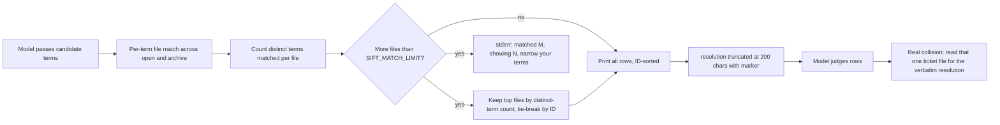
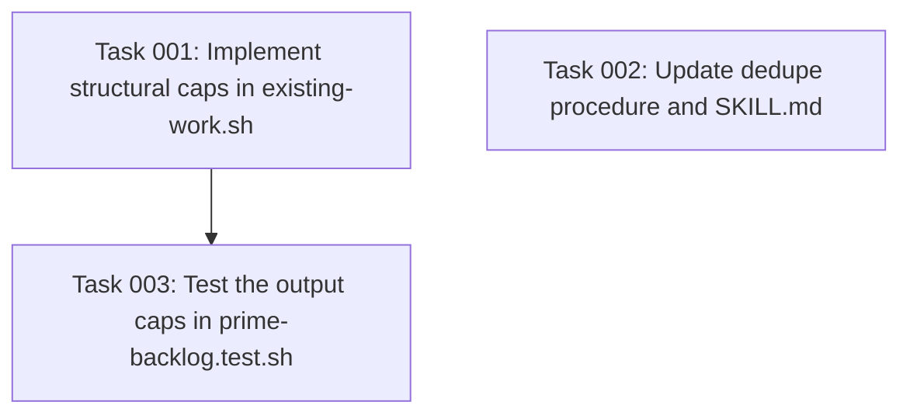

# Plan: Structural output caps for the existing-work collision query

## Original Work Order

> I just tried it, and it is still BAD. [Screenshot: a sift-prime run on `field_union` invoked `existing-work.sh` with twelve subject terms and received 228KB of output.]

This continues the work order behind plan 05: "I am seeing an obscene token usage when using Sift. I suspect it is related to the output of `existing-work.sh` for projects where sift has done a LOT of work."

## Plan Clarifications

| Question | Answer |
| --- | --- |
| Why did the plan 05 query contract still blow up? | The observed run queried with the project's own vocabulary (`translation`, `workflow`, `language`, and nine more, OR'd). On a single-subject project those words appear in nearly every ticket body, so whole-file matching selected most of the archive, and each matched row still carried its full ~1.8KB `resolution`. "Bounded by match count" is no bound when everything matches. |
| Remedy direction? | Structural bounds inside the script, so the output stays small even under the worst terms: truncate the `resolution` column per row, cap the number of rows, and print a stderr overflow notice carrying the match count and its own remedy. Approved. |
| Should the row cap rank survivors? | Yes. Rank by the number of distinct terms each file matched, so the capped set is the most relevant rows rather than the lowest IDs. Approved. |

Decisions made by the planner within the approved scope, called out for review during
refinement rather than asked one by one: the row cap defaults to 25 and is overridable
through a `SIFT_MATCH_LIMIT` environment variable following the existing `SIFT_ROOT` and
`SIFT_PREFIX` override pattern; the `resolution` column is truncated at 200 characters with
a fixed `...` marker; capped selection is ranked but the printed rows stay ID-sorted.

## Executive Summary

Plan 05 turned `existing-work.sh` from a full-corpus dump into a per-candidate collision query and promised output "bounded by the number of matches". The first real run on a heavy project broke that promise: on a project whose entire archive shares one subject, any subject-flavored term matches nearly everything, and the agent driving the skill passed twelve of them in one call, before the sweep had produced a single candidate. 228KB came back. The lesson is that no prompt guidance can guarantee narrow terms, so the script must stay cheap when the terms are broad.

This plan adds bounds that hold by construction. Each row's `resolution` column is truncated to a fixed budget with a visible marker, and at most a fixed number of rows are printed. When more tickets match than the cap allows, the script selects the survivors by relevance, the count of distinct terms each file matched, and tells the caller on stderr how many matched, how many were shown, and what to do about it. Worst case output on any project of any age is then a few kilobytes, roughly a 25x reduction against the observed 228KB even before the caller narrows anything.

The dedupe procedure changes with it. It gains the step the truncation requires, reading the one ticket file when a genuine collision needs its `resolution` quoted verbatim, and it closes the loophole the observed run walked through: dedupe queries run once per candidate after the sweep returns findings, never as a scope-wide prefetch of the fence's vocabulary, and good terms are the candidate's distinguishing words, not the project's shared subject words that match everything.

## Context

### Current State vs Target State

| Current State | Target State | Why? |
| --- | --- | --- |
| Every matched row carries its full `resolution`, ~1.8KB on the observed project | `resolution` is truncated to 200 characters with a `...` marker; the verbatim text comes from reading the one matched file when a real collision needs quoting | The full text is needed for two or three genuine collisions per run, not for every row that shares a word |
| Row count is unbounded; broad terms on a single-subject project return most of the archive | At most 25 rows (overridable via `SIFT_MATCH_LIMIT`); overflow reported on stderr with the match count and the remedy | The bound must survive bad terms, because prompt text cannot guarantee good ones |
| Overflow is silent; the caller cannot tell "few matches" from "cap did not exist" | stderr names how many matched and how many were shown, and says to narrow the terms | An incomplete answer that looks complete produces false dedupe verdicts; a detector prints its own remedy |
| All matching rows are equal; there is no relevance signal | Survivors are the files matching the most distinct terms, tie-broken by ID; printed rows stay ID-sorted | When the cap bites, the caller should see the likeliest collisions, not the oldest tickets |
| The procedure invites breadth ("synonyms and adjacent vocabulary") and does not forbid querying before the sweep | The procedure requires per-candidate queries after the sweep, distinguishing vocabulary, and defines how to react to the overflow notice | The observed run prefetched the fence's vocabulary in one call; the procedure text made that read like compliance |

### Background

The evidence is a second screenshot from the same consumer project as plan 05. The priming agent loaded the updated skill, then ran one query with every subject word of the user's scope fence: `translation translatable translate moderation moderated workflow revision revisionable langcode language content_translation content_moderation`. The output was 228KB, and the agent's next message was "The dedupe output was broad (228KB), I'll narrow it", which is the same degraded fallback loop plan 05 was meant to end.

Two independent faults compounded, and this plan fixes both because fixing either alone leaves the failure reachable. Fixing only the procedure leaves the script one bad prompt away from another 228KB call, and this run shows agents do make that call. Fixing only the script leaves the procedure steering agents into always hitting the cap, which turns every query's answer incomplete and pushes dedupe quality down.

Plan 05's risk table acknowledged whole-file matching noise and judged that "match counts stay small enough". That judgment fails structurally on single-subject projects: the more focused a project, the more its tickets share vocabulary, and sift-heavy projects are exactly the focused ones. This plan removes the dependence on that judgment instead of re-tuning it.

Constraints carried forward from plan 05 and the repo conventions: the 5-field TSV row shape stays; GNU and BSD userlands both; no installable binaries; grep's no-match status 1 absorbed but status 2 propagated; the `--` marker honored with a second loop; `tests/run.sh` is the gate. One new constraint applies: the stderr overflow notice must name its own remedy, following the repo's drift-detection convention that a detector tells the reader what to do.

## Architectural Approach

Three parts, landing together: bounded output in the script, a procedure that uses the bounds honestly, and tests that pin both, including the overflow behaviors.

### Bounded rows in existing-work.sh

**Objective**: Make the script's worst-case output a small constant regardless of archive size and term breadth.

The matching pass changes from one OR'd grep per file to one `grep -l` pass per term over the candidate file list, collecting file paths. Concatenating those per-term lists and counting repeats per path yields each file's distinct-term match count in one portable `sort | uniq -c` step, with no per-file-per-term process explosion. Grep's exit statuses keep their plan 05 handling: absorb 1, propagate 2 with the file context.

Selection applies `SIFT_MATCH_LIMIT`, default 25, validated as a positive integer with the same setup-error exit the other overrides use when malformed. When the matched-file count exceeds the limit, keep the files with the highest distinct-term counts, tie-broken by ascending ID so the selection is deterministic under any input order. Ranking decides survival only; the printed rows stay ID-sorted, preserving the reading contract plan 05 kept.

Row emission gains one transformation: after the existing control-character squash, a `resolution` longer than 200 characters is cut at 200 and suffixed with `...`. Character-based truncation in bash avoids splitting a multibyte sequence. Title, ID, status, and type are not truncated; the observed blowup lives entirely in `resolution`, and titles are the field the model judges with.

The overflow notice goes to stderr only, keeping stdout pure TSV, and reads in substance: matched M tickets, showing the N best matches; narrow the terms to this candidate's distinguishing vocabulary. Exit stays 0, because a capped answer is a successful answer with a stated limitation, not an error. The header comment is rewritten to document the cap, the ranking, the truncation marker, and the new environment variable.

### Honest bounds in the dedupe procedure

**Objective**: Close the prefetch loophole and give the model the two new moves the bounds require.

The Dedupe section of `references/analysis.md` gains three changes. First, cadence becomes explicit and prohibitive: one query per candidate, only after the sweep returns findings; querying the scope fence's vocabulary before candidates exist is named as the anti-pattern, because on a single-subject project the fence's words select the whole archive. Second, term guidance flips emphasis: still more than one term, but the terms are the candidate's distinguishing words, the file, the symptom, the mechanism, not the subject words every ticket in the project shares. Third, the reaction to the bounds: a `...`-marked resolution on a row being dropped as "already decided against" means reading that one ticket file and quoting the real `resolution` from it, and an overflow notice on stderr means the answer is incomplete, so re-query with narrower terms rather than judging from a capped list.

`SKILL.md` updates in the same pass: the Scripts listing line mentions the cap, and the gotcha list gains the overflow notice, since an agent that only reads stdout would mistake a capped answer for a complete one. Any `@PIN` lines touching reworded headings move with them.

### Test updates

**Objective**: Pin the caps with positive controls, including the case where they must not fire.

New cases in `tests/scripts/prime-backlog.test.sh`: a fixture past the row cap proves the cap fires, the survivor set is the top distinct-term matches, the tie-break is by ID, stdout stays ID-sorted, and stderr carries both the matched count and the shown count plus remedy wording; the same fixture under a raised `SIFT_MATCH_LIMIT` proves the cap is the only thing that was limiting, which is the positive control the testing conventions require; a long-resolution fixture proves truncation at the boundary with the marker, and a 200-character resolution proves no marker appears when nothing was cut; a malformed `SIFT_MATCH_LIMIT` proves the setup error. Existing plan 05 cases persist unchanged where behavior is unchanged: no-arg usage error, empty-term rejection, `--` handling, case-insensitive body matching, 5-field width, squashing.

The root-resolution sweep entry needs no change, since the script's minimum passing invocation is untouched. `tests/run.sh` gates the whole change.

## Risk Considerations and Mitigation Strategies

Technical Risks

- **The cap hides a true duplicate ranked below the cut**: a genuine collision matching one term loses to noise matching three.
    - **Mitigation**: the stderr notice makes the incompleteness visible and the procedure requires narrowing and re-querying on overflow instead of judging a capped list. A completed narrow query has no cut.
- **Distinct-term counting misranks**: term counts measure vocabulary overlap, not semantic identity.
    - **Mitigation**: ranking only chooses survivors under overflow; the model still judges every surviving row, and the re-query path exists for doubt. No verdict is delegated to the ranking.
- **Truncation corrupts a short multibyte resolution**: byte-based cutting could split a UTF-8 sequence.
    - **Mitigation**: character-based truncation in bash under the user's locale, with a test fixture containing multibyte text at the boundary.

Implementation Risks

- **The per-term grep pass changes the exit-status surface**: `grep -l` over many files exits 1 when a term matches nothing, which is normal, and 2 on a real error.
    - **Mitigation**: the plan 05 idiom carries over per term, absorb 1 and propagate 2, and the prime-backlog sweep keeps proving a clean tree still answers.
- **Prose drift across script, procedure, and pins**: three documents describe the contract.
    - **Mitigation**: one commit, and `tests/static/skill-prose-pins.test.sh` plus the static suite in `tests/run.sh` fail on stale pins.
- **Agents keep prefetching despite the procedure**: the observed run ignored cadence once already.
    - **Mitigation**: this is the reason the bounds are in the script. A prefetch after this plan costs at most the capped output, about 8KB, not 228KB.

## Success Criteria

### Primary Success Criteria

1. Reproducing the observed failure shape, a query whose terms match every ticket in a fixture archive larger than the cap, prints at most `SIFT_MATCH_LIMIT` rows, each with `resolution` at most 200 characters plus marker, and a stderr notice naming the matched count, the shown count, and the narrowing remedy.
2. A query matching fewer tickets than the cap prints every matched row with no notice, and a resolution at or under 200 characters is printed unmodified with no marker.
3. Under overflow, the surviving rows are the files with the highest distinct-term counts, deterministically tie-broken by ID, and stdout remains ID-sorted 5-field TSV.
4. The Dedupe section names the scope-wide prefetch as an anti-pattern, requires per-candidate cadence after the sweep, and instructs the file-read for verbatim quoting and the narrow-and-re-query response to overflow.
5. `tests/run.sh` passes.

## Self Validation

1. Build a fixture tree with 40 archived tickets whose bodies all contain the word "translation" and whose resolutions are ~1.5KB each, plus 3 open tickets. Run a query for "translation" and byte-count stdout: it must be under 10KB where the pre-plan script returns ~60KB, stderr must name 43 matched and 25 shown with the narrowing remedy, and every printed resolution must end in the marker at the 200-character boundary.
2. In the same tree, give exactly three tickets a second distinctive word and query both words: confirm those three tickets appear in the output, proving distinct-term rank decides survival. Re-run with `SIFT_MATCH_LIMIT=100` and confirm all 43 rows return with no stderr notice, the positive control that only the cap was limiting.
3. Run a query matching two tickets, one with a 150-character resolution: confirm both rows, no marker, no notice, and unchanged exit 0. Run with `SIFT_MATCH_LIMIT=abc` and confirm the setup-error exit with a message on stderr and nothing on stdout.
4. Place a multibyte character spanning the 200-character boundary in a fixture resolution and confirm the truncated output is valid text with no replacement garbage.
5. Run `tests/run.sh` from the repository root and confirm no failures and no newly skipped checks.
6. Re-read the Dedupe section and `SKILL.md` diff to confirm the prefetch prohibition, the distinguishing-vocabulary guidance, the file-read quoting step, and the overflow gotcha are all present, and `git status` shows changes only under `src/`, `tests/`, and `.ai/strikethroo/`.

## Documentation

- Rewrite the header comment of `src/skills/sift-prime/scripts/existing-work.sh`: the cap, the default and `SIFT_MATCH_LIMIT` override, the ranking rule, the truncation marker, and the stderr notice.
- Update `src/skills/sift-prime/SKILL.md`: the Scripts listing line and a new gotcha for the overflow notice on stderr.
- Rewrite the affected parts of the Dedupe section in `src/skills/sift-prime/references/analysis.md` as described.
- No change to README.md or AGENTS.md; the script remains outside the shipped convention's cookbook and the ticket schema stays untouched.

## Resource Requirements

### Development Skills

- Portable bash under the repo's GNU/BSD rules, including the grep exit-status idiom, `sort | uniq -c` counting, and locale-aware string truncation.
- This suite's testing conventions, positive controls in particular, per `tests/README.md` and the kenkeep `testing/` branch.

### Technical Infrastructure

- The Unix userland already on the machine; no new binaries.

## Integration Strategy

Script, procedure, and tests change in one commit inside the sift-prime skill and the test suite. Consuming repositories pick the change up when the skill ships to them. Old installs keep plan 05 behavior, which is internally consistent but unbounded; that is the deployment gap this plan exists to close, so shipping to the affected consumer project is the first real-world verification. `sift-drain` remains unaffected.

## Notes

- Out of scope: any `resolution` length bound in the spec, any change to ticket schema or archive layout, any change to sift-drain, and any semantic or embedding-based matching. The script stays lexical; the model stays the judge.
- The cap default of 25 and the 200-character resolution budget are planner-chosen values inside the approved direction. Both are single constants, one of them environment-overridable, and cheap to retune if real use argues for different numbers.

## Execution Blueprint

**Validation Gates:**
- Reference: `/config/hooks/POST_PHASE.md`

### ✅ Phase 1: Script bounds and procedure prose
**Parallel Tasks:**
- ✔️ Task 001: Implement structural output caps in existing-work.sh (row cap, ranking, truncation, stderr notice, header rewrite) — `completed`
- ✔️ Task 002: Update the dedupe procedure in references/analysis.md and SKILL.md for the bounded query — `completed`

### Phase 2: Tests
**Parallel Tasks:**
- Task 003: Test the output caps in prime-backlog.test.sh (depends on: 001)

### Post-phase Actions

- Run `tests/run.sh` from the repository root; it gates every phase via `POST_PHASE.md`.

### Execution Summary
- Total Phases: 2
- Total Tasks: 3
